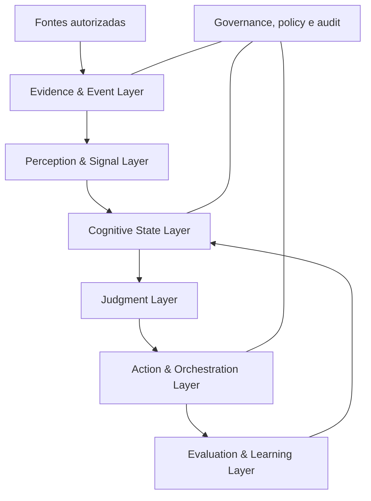
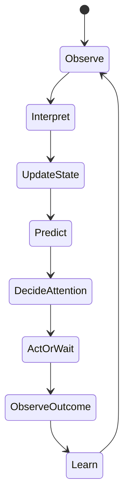

# Architecture Package v0.1 — “Second Brain” (nome provisório)

**Status:** hipótese arquitetural para revisão adversarial  
**Data:** 30 de agosto de 2026  
**Escopo:** arquitetura de produto, cognição, dados, memória, aprendizado, autonomia e avaliação  
**Fora de escopo nesta versão:** implementação, escolha de tecnologias, desenho de infraestrutura e naming definitivo

> Este documento não é uma especificação final. Ele organiza hipóteses testáveis, recomendações provisórias, trade-offs, riscos e decisões que ainda precisam de evidência.

## Resumo executivo

O produto proposto é uma **camada cognitiva pessoal sobre o trabalho**. Sua unidade central não é a conversa, a tarefa nem o documento: é o **estado vivo do trabalho**, reconstruído continuamente a partir de evidências temporais e incompletas.

O sistema deve transformar fluxos dispersos — reuniões, mensagens, e-mails, calendário, documentos, Figma e inputs diretos — em uma representação verificável de:

- o que está acontecendo;
- o que mudou;
- o que foi decidido e por quê;
- o que está em risco ou indefinido;
- o que provavelmente exigirá julgamento;
- o que pode ser preparado antecipadamente;
- quais hipóteses sobre a usuária parecem verdadeiras, em qual contexto e com qual confiança.

A arquitetura recomendada separa cinco funções:

1. **Percepção:** transformar eventos brutos em sinais e afirmações com proveniência.
2. **Estado cognitivo:** manter Work Graph, memórias e hipóteses temporais sem confundir inferência com fato.
3. **Julgamento:** detectar oportunidades, estimar atenção necessária e prever preferências ou decisões.
4. **Ação:** decidir entre agir, preparar, perguntar, esperar ou ignorar dentro de limites explícitos de autonomia.
5. **Metacognição:** avaliar qualidade, registrar previsões, comparar resultado real e atualizar modelos e políticas.

Para a V0, a recomendação é **um corte vertical estreito**, somente leitura nas fontes e autonomia limitada a sugerir ou preparar. A V0 deve provar três coisas antes de expandir: consegue reconstruir corretamente o trabalho, recuperar o contexto certo e produzir poucas intervenções realmente úteis. Fine-tuning, reward models próprios, roteamento aprendido e execução externa autônoma ficam explicitamente adiados.

---

## 1. Product thesis

### Tese

Profissionais que operam em ambientes fragmentados não sofrem apenas de falta de informação ou excesso de tarefas. Sofrem da necessidade contínua de **reconstruir contexto**, perceber mudanças sutis, lembrar compromissos implícitos, conectar sinais dispersos e transformar tudo isso em julgamento e ação.

“Second Brain” deve reduzir esse custo mantendo uma **estimativa viva, seletiva, temporal e baseada em evidência do estado do trabalho e da cognição da usuária**. O valor não vem de responder mais perguntas, mas de aumentar a qualidade e o timing da percepção, do julgamento e da preparação.

### Promessa de valor

> O sistema percebe o que mudou, entende por que isso pode importar, estima se precisa da sua atenção e prepara o próximo melhor movimento — com evidência, incerteza e controle explícitos.

### Unidade de valor

A unidade de valor não é “uma resposta gerada”. É uma **intervenção cognitiva útil**, que pode assumir cinco formas:

- tornar uma mudança relevante visível;
- reconstruir contexto com fidelidade;
- antecipar uma necessidade;
- preparar trabalho que seria feito depois;
- evitar uma decisão, interrupção ou ação desnecessária.

### Falsificabilidade da tese

A tese estará enfraquecida se, mesmo com boa captura de dados, o sistema:

- exigir mais manutenção do que o tempo que economiza;
- produzir proatividade percebida como ruído ou vigilância;
- não superar buscas, resumos e lembretes convencionais em decisões reais;
- não conseguir aprender preferências contextuais com estabilidade;
- depender de contexto manual extensivo para cada entrega.

**Decisões relacionadas:** D-01, D-02, D-15, D-20.

## 2. North-star experience

### Experiência norteadora

Ao iniciar um bloco de trabalho, a usuária não abre um chat vazio. Ela encontra um **estado de situação compacto e acionável**:

1. **O que mudou:** novos fatos, decisões, bloqueios e alterações desde o último ponto de atenção.
2. **O que merece julgamento:** no máximo poucos itens ordenados, cada um com “por que agora”, evidências, confiança e custo de não agir.
3. **O que já foi preparado:** rascunhos, análises, alternativas ou materiais reversíveis, ainda não enviados.
4. **O que o sistema não entendeu:** contradições, lacunas ou decisões para as quais uma pergunta curta produz alto ganho de informação.
5. **O que foi deliberadamente ignorado:** ruído ou itens de baixa relevância, inspecionáveis sob demanda.

Durante o dia, o sistema trabalha de modo majoritariamente silencioso. Quando interfere, deve explicar:

- qual sinal observou;
- que inferência fez;
- qual evidência sustenta a inferência;
- qual o nível de confiança;
- por que interromper agora parece melhor do que esperar;
- qual ação propõe e quão reversível ela é.

### Exemplo de experiência, sem assumir interface

> “A decisão sobre a direção visual parece ter mudado após a reunião de ontem, mas o documento principal ainda reflete a versão anterior. Há duas evidências concordantes e uma ambígua. Preparei uma lista de impactos no fluxo e no protótipo. Quer revisar agora ou deixar para antes da reunião de quinta?”

Esse exemplo combina percepção, temporalidade, contradição, preparação, confiança e escolha de atenção. Uma notificação “atualize o Figma” seria apenas task management com roupa nova.

### North-star outcome

**A usuária começa trabalhos importantes já dentro do contexto certo, recebe menos interrupções irrelevantes e encontra preparação útil antes de precisar pedi-la.**

### Métricas norteadoras candidatas

- proporção de intervenções consideradas úteis;
- proporção de trabalho preparado aproveitado, mesmo com edição;
- tempo evitado de reconstrução de contexto;
- taxa de falsos alarmes de atenção;
- decisões ou riscos importantes detectados antes de pedido explícito;
- confiança calibrada: quando o sistema diz 70%, acerta aproximadamente 70%;
- redução de perguntas desnecessárias sem aumento de erros relevantes;
- capacidade de justificar cada intervenção com evidência rastreável.

Essas métricas ainda precisam de baseline e definição operacional. Nenhum número-alvo é assumido nesta versão.

## 3. Core principles

1. **Evidência antes de inferência.** Fato observado, interpretação, hipótese, previsão, decisão e ação são objetos diferentes.
2. **Temporalidade é estrutura, não metadata decorativa.** O sistema precisa saber quando algo ocorreu, quando foi observado, por quanto tempo valeu e o que o substituiu.
3. **Incerteza deve sobreviver ao pipeline.** Uma extração incerta não pode virar certeza apenas porque passou por cinco componentes.
4. **Proveniência por padrão.** Toda afirmação derivada deve apontar para evidências, transformações e modelo ou regra que a produziu.
5. **Memória é reconstrução seletiva, não acumulação infinita.** Guardar tudo não significa lembrar bem.
6. **O Work Graph é uma projeção operacional.** Ele organiza o estado do trabalho, mas não substitui evidências originais.
7. **Preferências são contextuais e revisáveis.** Uma escolha isolada não define identidade; hábitos não são princípios; mudança não é erro.
8. **Personalização precisa ser falsificável.** O sistema registra previsão antes do resultado e mede acerto, calibração e drift.
9. **Atenção humana é o recurso mais caro.** O sistema também cria valor quando espera ou ignora.
10. **Autonomia é concedida por domínio e tipo de ação.** Não existe um único “nível de autonomia” global.
11. **Agentes executam trabalho; não são a memória nem a autoridade.** Estado, política, evidência e permissões vivem fora deles.
12. **Modelos são componentes substituíveis.** Contratos, avaliações e dados próprios sustentam independência cognitiva de fornecedor.
13. **Qualidade é pessoal, mas segurança não pode ser apenas pessoal.** Preferências individuais não anulam limites de privacidade, autorização e integridade.
14. **Explicabilidade proporcional ao risco.** Quanto maior o impacto, mais forte deve ser a evidência, a revisão e a justificativa.
15. **Começar com um sistema coerente, não distribuído.** Limites lógicos claros não implicam serviços separados na V0.
16. **Aprendizado deve melhorar decisões, não apenas aumentar atividade.** Mais sugestões, mais eventos processados ou mais chamadas de modelo não são sucesso.

**Decisões relacionadas:** D-01 a D-20.

## 4. Non-goals

### Não é objetivo estrutural

- ser um chatbot genérico ou uma nova interface de busca;
- substituir os sistemas de origem;
- ser um gerenciador de tarefas completo;
- construir apenas um RAG sobre documentos;
- automatizar tudo o que é tecnicamente automatizável;
- reproduzir a personalidade da usuária;
- criar uma “verdade psicológica” sobre a usuária;
- otimizar produtividade quantitativa sem considerar qualidade, energia, risco e intenção;
- tomar decisões irreversíveis ou representar a usuária externamente sem autorização específica;
- consolidar toda a história em um prompt permanente;
- implementar fine-tuning ou reward model antes de existir dataset válido;
- chamar múltiplos modelos em todas as tarefas só para parecer sofisticado;
- criar microserviços, filas ou agentes persistentes sem uma necessidade demonstrada;
- inferir atributos sensíveis sem propósito explícito, consentimento e controles reforçados;
- transformar silêncio, ausência de resposta ou demora em feedback inequívoco.

### Não-goals da V0

- escrever em Slack, enviar e-mail, editar Figma ou alterar calendários autonomamente;
- aprender roteamento de modelos online;
- manter um modelo comportamental abrangente;
- cobrir toda a vida pessoal e profissional;
- processar todas as fontes disponíveis;
- prometer antecipação ampla. A V0 testa poucos tipos de antecipação com alto valor observável.

## 5. System boundaries

### Dentro do sistema

- ingestão autorizada e normalização de eventos;
- interpretação de sinais e extração de objetos de trabalho;
- armazenamento de evidência e linhagem;
- representação temporal do trabalho;
- memória, consolidação e recuperação seletiva;
- hipóteses comportamentais e previsões;
- detecção de oportunidades e cálculo de atenção;
- políticas de autonomia e autorização;
- planejamento e execução controlada de trabalho;
- seleção de modelos e ferramentas;
- quality gates, avaliação e aprendizado;
- feedback, auditoria, observabilidade e controles de privacidade.

### Fora do sistema

- autoridade final dos sistemas de origem;
- políticas organizacionais da empresa e permissões concedidas pelos provedores;
- identidade legal da usuária;
- garantia de verdade de conteúdos externos;
- decisões humanas de alto impacto sem delegação explícita;
- treinamento ou operação interna de modelos fundacionais de terceiros;
- interpretação clínica, psicológica ou moral da usuária.

### Fronteiras de confiança

1. **Fontes externas:** podem conter dados incorretos, conflitantes, maliciosos ou sem autorização para reutilização.
2. **Modelos:** podem alucinar, perder instruções, revelar dados ou avaliar com vieses.
3. **Ferramentas de ação:** podem causar efeitos externos reais.
4. **Usuária:** pode mudar de ideia, agir por exceção ou fornecer feedback ambíguo.
5. **Organização:** regras, acessos e sensibilidade podem variar por workspace, projeto e pessoa.

### Regra de boundary

Cada dado e ação deve manter, no mínimo: origem, proprietário lógico, escopo de autorização, sensibilidade, política de retenção e possibilidades de uso. Acesso à fonte não implica permissão automática para inferir, compartilhar ou agir.

## 6. Conceptual architecture

Os componentes abaixo são **limites conceituais**, não serviços ou escolhas de infraestrutura.

### 6.1 Evidence & Event Layer

Responsável por capturar eventos, preservar conteúdo bruto ou referência recuperável, deduplicar, versionar e manter proveniência e permissões. O Raw Event Store pertence aqui.

### 6.2 Perception & Signal Layer

Transforma eventos em sinais estruturados sem decidir automaticamente o que eles “significam” para a usuária. Exemplos:

- decisão candidata;
- compromisso explícito ou implícito;
- mudança de escopo;
- pergunta em aberto;
- risco;
- divergência;
- prazo;
- trabalho repetido;
- indício de preferência;
- resultado observável.

Cada sinal inclui evidência, confiança e interpretação alternativa quando relevante.

### 6.3 Cognitive State Layer

Mantém quatro representações coordenadas:

- **Work Graph:** entidades, relações e estado operacional do trabalho;
- **Memory System:** memória de trabalho, episódica, semântica, procedural e de preferência;
- **Belief Store:** hipóteses sobre trabalho e comportamento;
- **Temporal State:** versões, validade, supersessão, dependências e mudanças.

### 6.4 Judgment Layer

Contém Opportunity Intelligence, Attention Engine, Personal Cognition Model, Personal Judgment Models e Personal Decision Simulator. Gera propostas e previsões; não executa efeitos externos.

### 6.5 Action & Orchestration Layer

Converte intenção aprovada em planos e unidades de trabalho, seleciona agentes, modelos e ferramentas, impõe orçamento, autorização, idempotência e checkpoints.

### 6.6 Evaluation & Learning Layer

Avalia extração, recuperação, julgamento, personalização, segurança e resultado. Registra feedback explícito, comportamento observado, previsões e outcomes. Atualiza modelos somente por políticas controladas.

### 6.7 Governance, Policy & Audit

Camada transversal que aplica privacidade, ACLs, autonomia, sensibilidade, retenção, observabilidade, contestabilidade e rollback.

**Recomendação estrutural:** preservar esses limites em contratos e dados, mas operar a V0 como um sistema único modular. Distribuição futura deve responder a requisitos reais de escala, isolamento, latência ou permissão.

**Decisões relacionadas:** D-01, D-02, D-03, D-11.

## 7. Cognitive architecture

### Loop cognitivo proposto

### 7.1 Observe

Captura eventos e mudanças sem exigir intenção explícita da usuária. A observação deve ser incremental e sensível a fonte, autoria, audiência e timing.

### 7.2 Interpret

Produz sinais candidatos. Interpretação é probabilística: uma pergunta em reunião pode ser dúvida genuína, provocação estratégica ou apenas esclarecimento. O sistema preserva alternativas quando isso muda a ação.

### 7.3 Update state

Atualiza Work Graph, memórias e crenças por regras de merge, contradição e supersessão. Nunca apaga silenciosamente um estado anterior relevante.

### 7.4 Predict

Antes de recomendar, tenta prever:

- se a usuária considerará o item relevante;
- qual decisão ou formato provavelmente preferirá;
- qual nível de acabamento exigirá;
- se agiria agora, depois ou nunca;
- qual ação produziria maior valor.

Previsões devem ser registradas antes de observar o comportamento real.

### 7.5 Decide attention

Separa relevância de urgência e valor de interrupção. O resultado pode ser: promover agora, agrupar para depois, preparar silenciosamente, aguardar mais evidência ou descartar.

### 7.6 Act or wait

A Action Policy escolhe entre agir, perguntar, preparar, esperar ou ignorar com base em autorização, risco, confiança, reversibilidade, prazo e custo de atenção.

### 7.7 Observe outcome and learn

O sistema coleta edição, aceitação, rejeição, timing, ação posterior e resultado. Como esses sinais são ambíguos, não atualiza diretamente uma “personalidade”; atualiza evidência de hipóteses específicas.

### Metacognição

O sistema também mantém uma estimativa de sua própria competência por tipo de tarefa:

- “extraio decisões de reuniões com boa precisão”;
- “ainda erro ao inferir prioridade em discussões exploratórias”;
- “o modelo A funciona melhor em síntese visual; o modelo B, em revisão crítica”.

Essa competência estimada influencia confiança, roteamento, quality gates e necessidade de perguntar.

## 8. Memory architecture

### 8.1 Separar tipo de memória de temperatura

“Hot / warm / cold” responde a **custo e frequência de acesso**. “Episódica / semântica / procedural / preferência” responde a **função cognitiva**. Misturar as duas taxonomias cria decisões erradas de retenção.

| Tipo lógico | Conteúdo | Exemplo | Consolidação |
| --- | --- | --- | --- |
| Memória de trabalho | Estado ativo e contexto imediato | reunião atual, decisão pendente | expira, promove ou arquiva |
| Episódica | Acontecimentos situados no tempo | “na review de terça, X foi rejeitado” | agrupa episódios sem apagar evidência |
| Semântica | Fatos e relações estabilizados | objetivo do projeto, responsáveis | requer suporte consistente e validade |
| Procedural | Como executar trabalho | checklist de review, formato de benchmark | aprende de repetições e correções |
| Preferência | Tendências contextuais da usuária | prefere alternativas com racional curto | hipótese, não verdade absoluta |
| Julgamento | Critérios aplicados em decisões | qualidade visual pesa mais em showcase | versionado por domínio e contexto |
| Outcome | Resultados e consequências | proposta aprovada, risco ocorreu | liga decisão e ação ao efeito observado |

Cada unidade pode estar quente, morna ou fria independentemente do tipo lógico.

### 8.2 Camadas de persistência conceitual

1. **Raw Event Store:** evento original ou ponteiro confiável, hash, fonte, ACL, timestamps e versão.
2. **Normalized Event Store:** representação canônica de eventos de fontes diferentes.
3. **Derived Knowledge Store:** sinais, claims, entidades, relações e resumos com lineage.
4. **Memory Store:** unidades consolidadas com políticas de validade, decaimento e recuperação.
5. **Model State Store:** hipóteses comportamentais, previsões, avaliações e versões do PCM.

### 8.3 Temporal memory

Recomendação: modelagem **bitemporal** no nível conceitual:

- **valid time:** quando a informação era verdadeira no mundo do trabalho;
- **system time:** quando o sistema recebeu, alterou ou acreditou naquela informação.

Isso permite responder “o que sabíamos na época?” e evita usar retroativamente uma decisão nova para interpretar uma ação antiga.

### 8.4 Memory consolidation

A consolidação deve:

- unir redundâncias sem perder proveniência;
- promover padrões somente após evidência suficiente;
- preservar contradições relevantes;
- marcar supersessão em vez de sobrescrever;
- reduzir detalhe acessado raramente sem destruir recuperabilidade;
- gerar resumos derivados com links para episódios e eventos;
- revalidar memórias quando novas evidências contradizem o estado atual;
- considerar importância, recorrência, recência, dependências e custo de perda.

### 8.5 Forgetting e decay

Esquecimento saudável inclui:

- expirar memória de trabalho;
- reduzir peso de preferências antigas sem evidência recente;
- arquivar detalhes de baixo valor;
- apagar dados por política ou solicitação;
- preservar trilhas mínimas quando necessárias para auditoria, conforme autorização.

“Cold” não significa “irrelevante” e “antigo” não significa “falso”. Um princípio estável pode ser antigo e muito relevante; uma urgência de ontem pode ter valor zero hoje.

### 8.6 Critérios de promoção

Uma informação não deve virar memória semântica ou preferência apenas por repetição textual. Promoção considera:

- diversidade de contextos e fontes;
- autoria e confiabilidade;
- consistência temporal;
- ação ou resultado correspondente;
- contradições e exceções;
- custo de estar errado.

**Decisões relacionadas:** D-01, D-04, D-16, D-19.

## 9. Context retrieval strategy

### Objetivo

Construir o **menor pacote de contexto suficiente** para uma decisão ou tarefa, com cobertura, temporalidade, permissões e contradições explícitas.

### Pipeline de recuperação

1. **Interpretar a necessidade:** intenção, tarefa, output, entidades, horizonte temporal, risco e usuário/audiência.
2. **Criar escopo:** usar Work Graph para localizar projeto, pessoas, decisões, dependências e episódios relacionados.
3. **Gerar candidatos:** busca lexical, semântica, relacional, temporal e por tipo de memória.
4. **Aplicar filtros duros:** ACL, sensibilidade, validade temporal, fonte e autorização.
5. **Reranquear:** relevância para a decisão, qualidade da evidência, recência adequada, diversidade e personalização.
6. **Detectar conflito e lacuna:** não esconder claims incompatíveis ou informação ausente de alto impacto.
7. **Montar Context Packet:** fatos, hipóteses, decisões, preferências aplicáveis, evidências e incertezas dentro de orçamento.
8. **Avaliar suficiência:** responder, perguntar, recuperar mais ou abster-se.

### Context Packet conceitual

- objetivo atual;
- estado do trabalho relevante;
- fatos e decisões válidos;
- eventos recentes que mudaram o estado;
- hipóteses e nível de confiança;
- critérios pessoais aplicáveis ao contexto;
- restrições, riscos e permissões;
- contradições e questões abertas;
- evidências citáveis;
- orçamento e instrução de ação.

### Estratégias contra context stuffing

- recuperar por decisão, não por tema amplo;
- preferir claims estruturados ligados a evidências em vez de resumos gigantes;
- usar expansão relacional limitada por necessidade;
- reservar espaço para contraevidência;
- comprimir de forma hierárquica, mantendo drill-down;
- registrar por que cada item entrou no pacote;
- medir contribuição marginal dos itens com testes de ablação.

### Falhas a evitar

- similaridade semântica confundida com relevância operacional;
- recência dominando princípios ou decisões ainda válidos;
- resumo antigo ocultando mudança posterior;
- preferência global aplicada fora de contexto;
- documento com acesso permitido contaminado por conteúdo sem permissão herdada;
- recuperação personalizada que só confirma crenças existentes.

**Decisões relacionadas:** D-03, D-05, D-13, D-19.

## 10. Behavioral learning architecture

### Princípio

Comportamento observado não é uma instrução inequívoca. Toda aprendizagem comportamental deve ser tratada como **inferência causal fraca e contextual**, a menos que exista feedback explícito ou repetição consistente.

### Fontes de sinal

#### Feedback explícito

- aceitou, rejeitou ou pediu para refazer;
- informou preferência ou princípio;
- corrigiu uma interpretação;
- alterou prioridade;
- autorizou ou revogou autonomia;
- avaliou utilidade ou qualidade.

#### Feedback implícito

- editou um rascunho;
- escolheu uma alternativa;
- ignorou, adiou ou retomou;
- mudou a ordem de trabalho;
- enviou ou não enviou algo preparado;
- repetiu manualmente uma atividade;
- desfez uma ação;
- mudou de decisão após novo contexto;
- resultado posterior confirmou ou desmentiu uma aposta.

### Hierarquia de evidência proposta

1. correção explícita específica;
2. preferência explícita com escopo;
3. decisão real repetida em contexto comparável;
4. edição consistente de outputs;
5. escolha única;
6. comportamento passivo, demora ou silêncio.

Essa hierarquia é provisória. O peso depende do domínio e do custo de inferência errada.

### Pipeline de aprendizado comportamental

1. registrar observação bruta;
2. ligar observação a contexto, alternativas disponíveis e resultado;
3. gerar ou atualizar hipótese específica;
4. buscar contraevidência e exceções;
5. atualizar confiança e faixa de validade;
6. produzir previsão futura;
7. comparar previsão com comportamento real;
8. calibrar ou versionar a hipótese;
9. detectar possível drift;
10. pedir feedback quando o valor de informação justificar a interrupção.

### Credit assignment

Uma edição não diz sozinha o motivo da edição. O sistema deve evitar atribuir toda diferença a gosto pessoal. Pode ter ocorrido por:

- nova informação;
- exigência de stakeholder;
- limitação de prazo;
- contexto político;
- erro factual;
- estilo;
- exploração deliberada;
- simples acaso.

Para decisões importantes, o sistema deve registrar alternativas disponíveis e, quando necessário, perguntar de forma mínima: “Você trocou X por Y por clareza, posicionamento ou restrição externa?”

### Active learning

Perguntar somente quando:

- a resposta muda materialmente uma decisão futura;
- a incerteza é alta;
- o padrão deve se repetir;
- o custo de perguntar é menor que o custo esperado de errar;
- não há boa evidência observável disponível.

**Decisões relacionadas:** D-06, D-07, D-16.

## 11. Personal Cognition Model

### Definição

O Personal Cognition Model (PCM) não é um perfil textual único nem um clone da usuária. É um **conjunto versionado de hipóteses, políticas e estimadores contextuais** sobre como ela percebe, prioriza, decide, executa e avalia qualidade.

### Submodelos conceituais

| Submodelo | Pergunta que responde | Exemplo de saída |
| --- | --- | --- |
| Relevance model | “Isso importa para ela neste contexto?” | probabilidade + razões |
| Attention timing model | “Precisa aparecer agora?” | agora, agrupar, esperar, ignorar |
| Decision preference model | “Qual alternativa ela tenderia a escolher?” | distribuição entre opções |
| Quality judgment model | “O que ela consideraria bom o suficiente?” | critérios e threshold |
| Work-style model | “Como ela tende a executar?” | sequência, formato, profundidade |
| Opportunity perception model | “Que tipo de oportunidade ela costuma notar?” | categorias e sinais |
| Communication model | “Como adapta mensagem por público?” | densidade, tom, evidência |
| Autonomy comfort model | “O que aceita delegar?” | política por domínio e ação |

### Anatomia de uma hipótese comportamental

- claim;
- tipo: hábito, preferência, princípio, estratégia, restrição ou tendência;
- domínio e contexto;
- evidências favoráveis;
- contraevidências;
- confidence e calibração;
- data de criação e última confirmação;
- intervalo de validade;
- exceções conhecidas;
- origem explícita ou implícita;
- modelo ou regra que inferiu;
- versão e hipótese substituída;
- custo de aplicar incorretamente.

### Hábitos, preferências, princípios e mudanças

- **Hábito:** recorrência comportamental; pode ser conveniência, não escolha.
- **Preferência:** escolha relativa entre alternativas em determinado contexto.
- **Princípio:** critério declarado ou repetidamente defendido, mais estável e normativo.
- **Mudança comportamental:** alteração sustentada que pode substituir ou restringir uma hipótese anterior.

O sistema não deve promover hábito a princípio. Também não deve tratar toda exceção como drift.

### Personal Decision Simulator

O conceito anteriormente descrito como “Sara Simulator” deve ser tratado internamente como **Personal Decision Simulator**, sem virar nome de produto. Sua função é:

1. receber opções, contexto, restrições e critérios;
2. prever uma distribuição de escolha, não uma resposta absoluta;
3. explicitar evidência utilizada e fatores ausentes;
4. produzir confiança calibrada;
5. abster-se quando o contexto não for comparável;
6. registrar a previsão antes da decisão real;
7. comparar previsão, decisão, justificativa e resultado.

Ele não deve impersonar a usuária nem enviar mensagens como se fosse ela. É um estimador de decisão para preparação e quality gates.

### Versionamento e drift

Um PCM versionado deve permitir:

- reproduzir qual versão informou uma recomendação;
- comparar performance entre versões;
- manter hipóteses específicas por contexto;
- detectar alteração gradual ou abrupta;
- reverter atualizações ruins;
- distinguir “modelo aprendeu” de “usuária mudou”.

### Métricas do PCM

- acurácia por tipo de decisão;
- Brier score ou métrica de calibração para previsões probabilísticas;
- regret da recomendação escolhida;
- taxa de abstenção adequada;
- precisão por domínio e contexto;
- estabilidade diante de ruído;
- velocidade de adaptação a drift sem esquecer padrões válidos;
- ganho sobre baseline não personalizado;
- taxa de correção explícita das hipóteses.

**Decisões relacionadas:** D-06, D-07, D-17, D-18.

## 12. Opportunity Intelligence

### Definição

Opportunity Intelligence detecta **possibilidades de criar valor ou evitar perda que ainda não foram formalizadas como tarefa**. Ela deve ser separada de task extraction e de prioridade.

### Fontes de oportunidades

- mudança recente que torna trabalho anterior obsoleto;
- decisão sem propagação para artefatos dependentes;
- compromisso implícito sem responsável ou prazo;
- divergência entre stakeholders;
- reunião futura que exigirá preparação;
- sequência repetida de trabalho manual;
- dúvida recorrente que sugere pesquisa ou decisão estrutural;
- material já existente que pode ser reaproveitado;
- resultado inesperado que merece investigação;
- conexão entre iniciativas antes isoladas;
- risco com janela curta de mitigação;
- oportunidade alinhada a objetivo declarado, mesmo sem urgência.

### Opportunity object

- descrição e categoria;
- evidências e sinais de origem;
- problema ou valor potencial;
- beneficiário e objetivo relacionado;
- janela temporal;
- custo estimado de preparação e execução;
- reversibilidade;
- dependências;
- confiança de que a oportunidade existe;
- confiança de que é relevante para a usuária;
- risco de falso positivo;
- próximo experimento ou ação mínima;
- estado: candidata, validada, preparada, apresentada, aceita, rejeitada, expirada ou realizada.

### Pipeline

1. detectar delta, padrão, lacuna ou convergência;
2. criar oportunidade candidata;
3. buscar evidências confirmatórias e contrárias;
4. deduplicar e ligar ao Work Graph;
5. estimar valor, timing, custo, risco e personal fit;
6. decidir se vale investigar mais;
7. enviar ao Attention Engine;
8. observar aceitação e resultado.

### Guardrail conceitual

Oportunidade não deve ser apresentada só porque é plausível. Precisa superar o custo de atenção ou ser preparada silenciosamente de modo barato e reversível.

**Decisões relacionadas:** D-08, D-09, D-15.

## 13. Attention and prioritization model

### Separar quatro perguntas

1. Isso é relevante?
2. Isso é importante?
3. Isso é urgente?
4. Isso merece interromper agora?

Um item pode ser importante e não merecer interrupção. Pode ser urgente para outra pessoa e irrelevante para a usuária. Pode ter baixo valor intrínseco, mas desbloquear trabalho crítico.

### Vetor de priorização proposto

Não reduzir cedo demais a um score único. Manter inicialmente um vetor com:

- alinhamento a objetivos e responsabilidades;
- impacto positivo potencial;
- perda esperada por inação;
- urgência e janela de oportunidade;
- dependências desbloqueadas;
- confiança da evidência;
- confiança da personalização;
- custo de ação;
- custo de interrupção;
- reversibilidade;
- risco e sensibilidade;
- disponibilidade ou carga atual;
- novidade versus repetição;
- possibilidade de agrupar.

Um score pode ordenar candidatos, mas a explicação deve preservar os fatores.

### Expected Attention Value

Como hipótese inicial:

**EAV = benefício esperado da atenção agora − custo de interrupção − custo do falso positivo − valor de esperar por mais evidência**

Não é uma fórmula definitiva. Serve para tornar explícito que “urgente” não basta e que esperar pode ter valor.

### Saídas possíveis

- **Interromper agora:** risco ou janela curta, alta relevância e ação possível.
- **Promover no próximo checkpoint:** importante, mas não interruptivo.
- **Agrupar:** itens relacionados com baixo valor individual.
- **Preparar silenciosamente:** alta chance de utilidade, baixo risco e reversível.
- **Esperar:** evidência insuficiente ou contexto prestes a mudar.
- **Ignorar/expirar:** baixo valor esperado.

### Attention budget

O sistema deve operar com orçamento explícito de atenção por período e canal. A quantidade de alertas não pode crescer linearmente com as fontes conectadas.

### Métricas

- precision@k dos itens promovidos;
- taxa de interrupção considerada justificável;
- tempo entre detecção e momento útil;
- falsos negativos graves identificados retrospectivamente;
- proporção de itens agrupados ou silenciosamente resolvidos;
- calibração entre EAV previsto e utilidade observada.

**Decisões relacionadas:** D-08, D-09, D-16.

## 14. Autonomy model

### Autonomia por domínio e ação

A mesma usuária pode permitir que o sistema reorganize notas, proibir envio de e-mail e autorizar preparação de protótipos. Autonomia deve ser uma matriz, não uma escada global.

### Níveis de autonomia candidatos

| Nível | Capacidade | Exemplo |
| --- | --- | --- |
| A0 — observar | ler e modelar estado | detectar decisão candidata |
| A1 — sugerir | apresentar proposta | sugerir revisar um fluxo |
| A2 — preparar | criar artefato reversível não publicado | rascunhar análise ou mensagem |
| A3 — executar internamente | alterar estado interno reversível | consolidar memória, agrupar sinais |
| A4 — executar externamente com limites | agir em fonte com política específica | criar rascunho em ferramenta aprovada |
| A5 — delegação contínua | operar um domínio dentro de orçamento e regras | manter rotina recorrente autorizada |

### Action Policy

Para cada ação, considerar:

- autorização explícita e escopo;
- risco de dano;
- reversibilidade e capacidade de rollback;
- exposição externa e identidade representada;
- confiança factual;
- confiança na intenção da usuária;
- sensibilidade dos dados;
- urgência;
- custo de pedir confirmação;
- precedente e histórico de sucesso;
- política organizacional;
- orçamento de tempo, dinheiro e chamadas.

### Decisão agir / perguntar / esperar / ignorar

| Condição dominante | Política recomendada |
| --- | --- |
| sem autorização ou ação irreversível | perguntar ou bloquear |
| risco alto, mesmo com confiança alta | revisar e confirmar |
| confiança baixa, pergunta de alto valor | perguntar |
| confiança baixa, baixo custo de esperar | esperar |
| confiança alta, ação reversível e autorizada | preparar ou executar conforme nível |
| baixo valor e alto custo de atenção | ignorar ou agrupar |
| urgência alta e risco de inação maior | escalar com evidência e opção mínima |

### Escalada progressiva

Autonomia aumenta por combinação de domínio + ação + audiência, com base em histórico observado. Repetição bem-sucedida pode gerar proposta de expansão, nunca expansão silenciosa.

### Requisitos de execução

- preview quando aplicável;
- idempotência;
- log de intenção, plano e efeito;
- limite de escopo;
- confirmação de resultado;
- rollback ou compensação;
- kill switch;
- expiração de grants;
- proibição explícita de usar aprovação de uma ação como autorização geral.

**Decisões relacionadas:** D-10, D-15, D-17.

## 15. Agent architecture

### Papel dos agentes

Agentes são **workers orientados a capacidade e tarefa**, criados para executar unidades de trabalho. Eles não devem manter memória privada autoritativa, decidir suas próprias permissões ou coordenar-se livremente sem política.

### Componentes conceituais

- **Planner/Coordinator:** decompõe objetivo e cria plano limitado.
- **Capability Registry:** declara o que cada worker, modelo e ferramenta pode fazer.
- **Context Builder:** fornece Context Packets mínimos.
- **Workers:** pesquisa, análise, produção, transformação ou execução.
- **Critic/Evaluator:** avalia contra critérios e evidências.
- **Action Controller:** aplica autorização, orçamento e efeitos externos.
- **Run Ledger:** registra entradas, decisões, modelos, ferramentas, custos e outputs.

### Padrão recomendado

1. receber intenção ou oportunidade aprovada;
2. definir outcome, constraints e quality gate;
3. decompor apenas se necessário;
4. atribuir workers por capacidade;
5. fornecer contexto mínimo e permissões mínimas;
6. executar com checkpoints;
7. avaliar;
8. revisar ou escalar;
9. persistir somente resultados e aprendizados aprovados.

### O que não fazer

- agentes conversando indefinidamente entre si;
- cada agente com sua própria memória divergente;
- acesso irrestrito a todas as fontes;
- delegação recursiva sem orçamento;
- usar “debate de agentes” como substituto de avaliação;
- criar um agente permanente para cada conceito arquitetural;
- permitir que o gerador seja o único juiz de seu trabalho.

### Orquestração adaptativa

Nem toda tarefa precisa de agentes múltiplos. O coordinator escolhe entre:

- resposta direta de um modelo;
- modelo + ferramenta;
- worker único + evaluator;
- plano multiworker;
- execução determinística sem LLM;
- abstenção ou pergunta.

**Decisões relacionadas:** D-02, D-11, D-13.

## 16. Model Intelligence / routing

### Objetivo

Escolher a combinação de modelo, ferramentas e estratégia com maior utilidade esperada para a tarefa, considerando qualidade, custo, latência, tokens, modalidade, risco, privacidade e performance histórica.

### Separação conceitual

- **Task Classifier:** descreve a tarefa sem escolher modelo.
- **Capability Registry:** capacidades, limites e políticas por modelo.
- **Routing Policy:** seleciona estratégia e fallback.
- **Execution Adapter:** contrato uniforme por provedor.
- **Performance Store:** resultados por arquétipo de tarefa.
- **Budget Controller:** custo, tokens e latência.
- **Routing Evaluator:** compara decisão de roteamento com outcome.

### Features de roteamento candidatas

- arquétipo da tarefa;
- modalidade;
- tamanho e natureza do contexto;
- necessidade de tool use;
- complexidade de raciocínio;
- tolerância a latência;
- custo máximo;
- risco e sensibilidade;
- necessidade de estilo pessoal;
- disponibilidade e falha do provedor;
- performance histórica específica;
- necessidade de diversidade ou avaliação independente.

### Estratégia recomendada por estágio

#### V0

- contratos provider-neutral;
- um caminho primário simples por arquétipo;
- fallback explícito;
- benchmarks periódicos com pelo menos um modelo alternativo;
- shadow evaluation em amostras, não em toda chamada;
- registro completo para replay.

#### Depois de dados suficientes

- regras calibradas por performance;
- seleção contextual por ranking ou bandit;
- combinação gerador + evaluator quando o ganho justificar custo;
- roteamento sensível a qualidade pessoal;
- otimização multiobjetivo com limites duros de segurança.

### Princípio de independência cognitiva

Independência não significa usar três provedores sempre. Significa possuir:

- contratos estáveis;
- memória e estado fora dos modelos;
- prompts e policies versionados;
- eval sets próprios;
- capacidade de replay;
- outputs estruturados normalizados;
- métricas comparáveis;
- fallback e substituição sem perder o modelo cognitivo pessoal.

### Riscos específicos

- benchmark contaminado ou pouco representativo;
- modelos avaliando melhor outputs parecidos com os próprios;
- custo do ensemble superar valor;
- roteamento instável por pequenas diferenças;
- exposição desnecessária de dados a vários provedores;
- otimização por métrica que degrada confiança percebida.

**Decisões relacionadas:** D-12, D-13, D-14, D-18.

## 17. Evaluation architecture

### Avaliação em camadas

| Camada | Pergunta | Exemplos de métricas |
| --- | --- | --- |
| Ingestão | capturou sem perder identidade e ACL? | completude, duplicação, freshness |
| Percepção | detectou corretamente o sinal? | precision/recall por tipo, confidence calibration |
| Estado | representou mudanças e relações? | consistência temporal, contradições não resolvidas |
| Retrieval | trouxe contexto suficiente e permitido? | recall, precision, provenance, ablation gain |
| Oportunidade | encontrou valor latente real? | acceptance, realized value, false positives |
| Atenção | promoveu no momento certo? | precision@k, interruption regret |
| Personalização | previu julgamento ou preferência? | lift sobre baseline, calibration, abstention quality |
| Output | atende critérios de qualidade? | rubric score, edit distance, groundedness |
| Ação | respeitou autorização e produziu efeito correto? | policy violations, rollback, success rate |
| Outcome | melhorou trabalho real? | tempo poupado, risco evitado, decisão melhorada |

### Quality gates antes da entrega

1. **Grounding gate:** claims importantes têm evidência e proveniência?
2. **Temporal gate:** o contexto ainda é válido? Há decisão superseding?
3. **Permission gate:** todos os dados e ações respeitam ACL e uso permitido?
4. **Task gate:** o output resolve a necessidade, não apenas o prompt literal?
5. **Personal quality gate:** atende critérios relevantes do PCM com confiança suficiente?
6. **Risk gate:** dano, exposição e irreversibilidade estão dentro da policy?
7. **Contradiction gate:** divergências relevantes foram expostas?
8. **Delivery gate:** vale interromper ou deve ser agrupado, preparado ou omitido?

### Métodos

- datasets rotulados de episódios reais;
- replay temporal preservando “o que era conhecido na época”;
- testes de regressão por competência;
- avaliação cega de alternativas;
- pairwise preference tests;
- avaliação humana amostral;
- model-as-judge com calibração e diversidade de juiz;
- testes adversariais de permissão, prompt injection e memória;
- online measurement com guardrails;
- análise de falhas graves, não só média.

### Personal Quality Evaluator

Inicialmente, deve ser uma composição de:

- rubricas explícitas da usuária;
- exemplos aceitos/rejeitados;
- critérios por domínio;
- regras de grounding e segurança;
- evaluator model independente quando útil.

Um reward model próprio só passa a ser candidato quando houver volume, diversidade, consistência e qualidade de rótulos suficientes para superar essa composição.

### Avaliação de previsões

Toda previsão comportamental relevante precisa registrar:

- alternativas conhecidas;
- probabilidade por alternativa;
- contexto disponível;
- versão do PCM;
- previsão temporalmente anterior ao outcome;
- resultado observado;
- explicação de erro e possível ambiguidade.

**Decisões relacionadas:** D-07, D-12, D-13, D-14, D-18.

## 18. Learning and ML evolution strategy

### Regra de evolução

Adicionar aprendizado estatístico quando ele superar uma baseline mais simples em dados representativos e com custo operacional aceitável. “Temos logs” não equivale a “temos dataset”.

### Estágios propostos

#### Estágio 0 — Instrumentação e baselines

- taxonomias mínimas;
- regras e prompts versionados;
- feedback explícito;
- previsões registradas;
- outcomes ligados a decisões;
- dataset de replay temporal;
- métricas e baselines não personalizados.

#### Estágio 1 — Personalização baseada em evidência

- hipóteses comportamentais com pesos manuais ou estatística simples;
- reranking contextual;
- thresholds calibrados;
- detecção simples de recorrência e drift;
- escolha ativa de perguntas.

#### Estágio 2 — Learning to rank e preference learning

- ranking de contexto e atenção;
- modelos pairwise de preferência;
- calibração de relevância;
- previsão contextual de formato e decisão;
- avaliação offline rigorosa antes de ativação.

#### Estágio 3 — Routing learning e decisão sequencial

- contextual bandits para roteamento de modelos ou estratégias;
- otimização de custo/latência/qualidade com constraints;
- exploração limitada e segura;
- shadow mode e rollback.

#### Estágio 4 — Modelos personalizados treinados

- reward model pessoal;
- fine-tuning de tarefas específicas;
- modelos de sequência ou embeddings personalizados;
- somente quando houver vantagem comprovada sobre retrieval + prompting + ranking.

### Critérios mínimos antes de ML mais complexo

- definição estável da tarefa;
- outcomes observáveis;
- dados suficientes por contexto, não apenas no total;
- rótulos com concordância ou incerteza registrada;
- baseline forte;
- split temporal para evitar leakage;
- política de privacidade compatível;
- capacidade de rollback e comparação;
- ganho relevante fora da amostra;
- monitoramento de drift e falha.

### Fine-tuning na V0

Não recomendado. Os gargalos prováveis da V0 são qualidade de estado, recuperação, taxonomia, confiança, feedback e experiência de atenção. Fine-tuning precoce congelaria suposições ruins dentro de um artefato difícil de interpretar.

**Decisões relacionadas:** D-07, D-12, D-16, D-18.

## 19. Data model at conceptual level

### 19.1 Primitivas de evidência

| Objeto | Função |
| --- | --- |
| Source | sistema ou canal de origem |
| RawEvent | evento original ou referência verificável |
| NormalizedEvent | evento em formato canônico |
| Artifact | documento, frame, thread, mensagem, reunião ou output |
| EvidenceSpan | trecho, região ou intervalo que sustenta um claim |
| Actor | pessoa, equipe, agente ou sistema |

### 19.2 Primitivas de trabalho

| Objeto | Função |
| --- | --- |
| Workstream | iniciativa ou contexto contínuo |
| Goal | resultado desejado |
| Deliverable | artefato ou resultado esperado |
| Decision | escolha, estado, racional e alternativas |
| Commitment | promessa, responsável, prazo e status |
| Question | incerteza explícita ou implícita |
| Risk | evento negativo possível e mitigação |
| Dependency | condição ou bloqueio entre objetos |
| Task | trabalho explícito já reconhecido |
| Change | delta relevante de estado |
| Outcome | efeito observado de decisão ou ação |

### 19.3 Primitivas cognitivas

| Objeto | Função |
| --- | --- |
| Signal | interpretação candidata de eventos |
| Claim | afirmação derivada com evidência e confiança |
| MemoryUnit | item consolidado de um tipo de memória |
| BehavioralObservation | comportamento ligado a contexto e alternativas |
| PreferenceHypothesis | preferência contextual falsificável |
| JudgmentRule | critério ou política inferida/declarada |
| Prediction | previsão registrada antes do resultado |
| ModelVersion | snapshot versionado do PCM ou submodelo |
| Feedback | sinal explícito ou implícito com ambiguidade |

### 19.4 Primitivas de proatividade e ação

| Objeto | Função |
| --- | --- |
| Opportunity | possibilidade latente de valor |
| AttentionCandidate | item avaliado para promoção |
| ActionProposal | ação sugerida e justificativa |
| AutonomyGrant | permissão por domínio, ação, limite e validade |
| WorkPlan | decomposição controlada de objetivo |
| AgentRun | execução de worker com contexto e budget |
| ModelRun | chamada normalizada a modelo |
| ToolCall | chamada com escopo, input e efeito |
| ActionRecord | tentativa, confirmação, efeito e rollback |
| Evaluation | score, rubric, judge e evidência |

### 19.5 Relações essenciais

- evento **origina** sinal;
- evidence span **sustenta ou contradiz** claim;
- claim **atualiza** Work Graph ou memória;
- decisão **substitui, restringe ou depende de** decisão;
- oportunidade **emerge de** sinais e **serve** goal;
- action proposal **requer** autonomy grant;
- previsão **usa** model version e **é resolvida por** outcome;
- feedback **avalia** output, ação, hipótese ou previsão;
- avaliação **qualifica** model run, agent run ou action record.

### 19.6 Campos transversais

Todos os objetos derivados relevantes devem considerar:

- identificador estável;
- valid time e system time;
- provenance e lineage;
- confidence;
- status e versão;
- sensibilidade;
- ACL e purpose limitation;
- owner e workspace;
- política de retenção;
- origem humana, regra, modelo ou combinação;
- possibilidade de contestação e correção.

### Work Graph

O Work Graph é uma projeção de objetos e relações, otimizada para navegação e recuperação contextual. Não é obrigatório usar tecnologia de graph database. O modelo lógico deve vir antes do mecanismo físico.

**Decisões relacionadas:** D-01, D-03, D-19.

## 20. Privacy and security considerations

### Princípios

- consentimento e propósito explícitos por fonte;
- menor privilégio;
- coleta e retenção mínimas;
- propagação de ACL da fonte para derivados;
- separação entre workspaces e contextos pessoais;
- dados do PCM tratados como altamente sensíveis;
- possibilidade de inspeção, correção, exportação e exclusão;
- nenhum uso para treinamento de terceiros sem opt-in explícito;
- ação externa sempre ligada a identidade, autorização e audit trail.

### Principais ameaças

1. **Prompt injection em conteúdo ingerido:** instruções maliciosas em e-mail, documento ou web.
2. **Privilege escalation:** agente ou modelo acessa fonte ou ferramenta além do necessário.
3. **Cross-context leakage:** informação de um projeto, pessoa ou workspace aparece em outro.
4. **Inference overreach:** sistema infere atributo sensível ou intenção sem base ou finalidade.
5. **Provider leakage:** dados desnecessários enviados a modelos externos.
6. **Memory poisoning:** conteúdo incorreto ou malicioso vira memória consolidada.
7. **Unauthorized action:** preparação ou execução interpretada como consentimento geral.
8. **Audit gap:** não é possível reconstruir por que uma ação ocorreu.
9. **Deletion failure:** derivados e modelos preservam dado que deveria ter sido removido.
10. **Behavioral surveillance:** produto passa de assistência para monitoramento invasivo.

### Controles conceituais

- conteúdo de fonte é dado, nunca instrução privilegiada;
- isolamento entre instruções do sistema, políticas e conteúdo recuperado;
- capability-based access e tokens de curta duração;
- redaction ou transformação antes de envio ao modelo quando possível;
- classificação de sensibilidade e roteamento por política;
- provenance obrigatória para consolidação;
- quarantine de claims suspeitos;
- approval gates e dry runs;
- trilha append-only de decisões e ações relevantes;
- retenção por camada e exclusão em cascata verificável;
- testes adversariais recorrentes;
- visão para a usuária de “o que o sistema acredita sobre mim”;
- bloqueio ou controles reforçados para inferências sensíveis.

### Tensão central

Personalização profunda exige observar comportamento; confiança exige que essa observação seja limitada, inteligível e controlável. Isso é uma decisão de produto, não apenas segurança de backend.

**Decisões relacionadas:** D-10, D-14, D-17.

## 21. Proposed V0

### Objetivo da V0

Provar o loop mínimo:

> sinais autorizados → estado confiável do trabalho → contexto seletivo → poucas oportunidades/atenções úteis → preparação reversível → feedback e medição

### Recorte recomendado

#### Domínio

Um único contexto profissional ou projeto ativo por vez, com vocabulário e stakeholders limitados.

#### Fontes

- input direto;
- calendário;
- notas ou transcrições de reuniões selecionadas;
- um conjunto restrito de documentos do projeto.

Slack, e-mail e Figma devem entrar depois, uma fonte por vez, medindo ganho marginal e ruído. A escolha final das fontes iniciais precisa ser validada pelo histórico real da usuária.

#### Capacidades

- ingestão somente leitura;
- Raw/Normalized Events com provenance;
- extração de decisão, compromisso, questão, mudança e risco;
- Work Graph de um domínio;
- memória de trabalho, episódica e semântica mínima;
- retrieval com Context Packets;
- três detectores de proatividade:
  - compromisso ou prazo em risco;
  - decisão não propagada;
  - preparação para evento próximo;
- briefing em checkpoint, não feed contínuo;
- preparação de rascunhos e análises sem publicação;
- feedback explícito: útil, não útil, incorreto, cedo/tarde e edição;
- registro de previsão simples e outcome;
- evaluator baseado em grounding, temporalidade, relevância e rubrica pessoal inicial;
- contratos de modelo independentes de fornecedor e replay set.

#### Autonomia

A0 a A2: observar, sugerir e preparar. Nenhuma escrita ou envio em sistemas externos.

#### Model Intelligence

Roteamento simples, baseado em regras. Um caminho primário por arquétipo e comparação periódica em shadow/replay com modelo alternativo. Sem roteador aprendido.

#### Personal Cognition Model

Somente hipóteses explícitas e algumas hipóteses comportamentais de baixo risco, visíveis e corrigíveis. Nada de “perfil psicológico” ou modelo abrangente.

### O que a V0 deve demonstrar

- reconstrução temporal confiável de um projeto;
- melhoria sobre resumo cronológico simples;
- recuperação que reduz contexto sem perder decisões críticas;
- precisão aceitável no top de itens de atenção;
- pelo menos um tipo de preparação com reutilização real;
- feedback coletado sem esforço excessivo;
- capacidade de explicar e corrigir crenças;
- portabilidade entre pelo menos dois modelos em replay, sem reescrever o núcleo cognitivo.

### Critérios de parada ou pivot

- manutenção manual recorrente supera benefício;
- baixa confiança nas fontes impede estado consistente;
- proatividade não supera briefing manual ou resumo;
- feedback não produz sinal utilizável;
- riscos de privacidade não podem ser isolados no recorte;
- qualidade depende mais de acesso indiscriminado do que de recuperação seletiva.

**Decisões relacionadas:** D-02, D-12, D-15, D-18, D-20.

## 22. Build sequence

Esta sequência é de aprendizagem, não um roadmap de features.

### Fase 0 — Cognitive trace study

- selecionar episódios históricos representativos;
- reconstruir o que estava disponível em cada momento;
- rotular decisões, mudanças, riscos, oportunidades e ações;
- registrar o que a usuária percebeu, quando percebeu e o que teria sido útil antes;
- criar taxonomia mínima e baseline.

**Saída:** dataset de replay temporal e mapa de decisões reais.

### Fase 1 — Evidence spine

- definir contratos conceituais de evento, claim, provenance, tempo e ACL;
- ingerir input direto e uma fonte de alta densidade;
- validar deduplicação, identidade, ordem e permissões;
- tornar cada derivação inspecionável.

**Saída:** trilha confiável de evidência.

### Fase 2 — Thin vertical slice

- extrair poucos sinais;
- construir estado mínimo do projeto;
- recuperar Context Packet;
- gerar briefing de mudança;
- medir contra reconstrução humana.

**Saída:** primeiro loop ponta a ponta, ainda reativo.

### Fase 3 — Memory and temporal consolidation

- adicionar episódios, claims semânticos, supersessão e contradições;
- testar consolidação e esquecimento;
- executar replay “o que sabíamos na época?”.

**Saída:** memória temporal utilizável sem context stuffing.

### Fase 4 — Opportunity and attention

- ativar três classes estreitas de oportunidade;
- ordenar top-k;
- introduzir attention budget;
- operar em shadow mode antes de interromper.

**Saída:** primeira proatividade mensurável.

### Fase 5 — Preparation and quality gates

- preparar um tipo de artefato reversível;
- aplicar evaluator e personal rubric;
- medir aproveitamento, edição e erro.

**Saída:** trabalho adiantado com valor real.

### Fase 6 — Behavioral hypotheses and prediction

- registrar escolhas, correções e previsões;
- criar hipóteses versionadas de baixo risco;
- medir lift sobre baseline não personalizado;
- introduzir active learning mínimo.

**Saída:** PCM inicial testável.

### Fase 7 — Expand sources and autonomy selectively

- adicionar uma fonte por experimento;
- medir ganho marginal, ruído e risco;
- propor grants de autonomia por ação apenas após histórico.

**Saída:** expansão justificada, não acúmulo de integrações.

### Fase 8 — Adaptive routing and ML

- comparar modelos por arquétipo;
- introduzir ranking aprendido onde baseline falhar;
- avaliar bandits, preference models ou fine-tuning somente com dataset suficiente.

**Saída:** sofisticação baseada em ganho comprovado.

**Decisão de sequência:** construir cortes verticais finos. Não terminar “toda a memória” antes de testar uma experiência útil.

## 23. Architectural risks

| Risco | Como falha | Mitigação inicial | Sinal de alerta |
| --- | --- | --- | --- |
| Memory poisoning | inferência errada vira fato persistente | lineage, confidence, quarantine, correção | claims sem evidência citável |
| Proatividade ruidosa | sistema vira mais uma inbox | attention budget, shadow mode, precision@k | dismiss/ignore crescente |
| Overpersonalization | reforça padrões antigos e reduz exploração | contraevidência, baseline neutro, drift | sugestões repetitivas/conservadoras |
| Behavioral surveillance | usuária perde confiança | propósito, visibilidade, controle, minimização | desconforto ou desativação de fontes |
| Feedback ambiguity | silêncio vira “rejeição” | pesos fracos, perguntas seletivas | hipóteses mudam com sinais passivos |
| Context leakage | dados aparecem fora de escopo | ACL propagation, isolation tests | citação de fonte não autorizada |
| Temporal corruption | decisão nova reescreve história | bitemporalidade, supersessão | replay histórico inconsistente |
| Agent drift | execução foge do objetivo | plans limitados, capability scopes, budgets | chamadas recursivas ou sem justificativa |
| Autonomy incident | ação externa indevida | grants específicos, preview, rollback | ação sem policy resolvida |
| Evaluator bias | judge favorece estilo/modelo | eval humana, judges diversos, calibration | alta divergência com preferência real |
| Router complexity | custo e instabilidade sem ganho | regras simples, benchmarks, shadow | variação alta sem lift de qualidade |
| Vendor lock-in | estado cognitivo preso a provedor | contratos, replay, dados próprios | troca exige reconstruir memória |
| Retrieval confirmation bias | só recupera evidência concordante | contradiction search, diversity | ausência sistemática de contraevidência |
| Ontology rigidity | taxonomia não acompanha trabalho | schemas evolutivos e versionados | muitos “outros” e correções manuais |
| Source failure | sistema age com dados incompletos | freshness e health como evidência | confiança alta com conector atrasado |
| Goodhart | sistema otimiza cliques/aceites | métricas balanceadas e outcomes | mais interação sem valor percebido |
| Cold-start | personalização parece genérica | explicitar baseline e pedir pouco feedback | baixa utilidade inicial |
| Cost explosion | múltiplos modelos e fontes escalam custo | budgets, caches conceituais, amostragem | custo por intervenção útil sobe |
| No ground truth | “o que ela faria” é ambíguo | previsão probabilística e outcome contextual | falsas certezas em decisões abertas |

## 24. Open questions

### Produto e experiência

1. Qual episódio real melhor representa o valor extraordinário esperado?
2. O produto deve aparecer principalmente em checkpoints, por objeto de trabalho ou em uma superfície contínua?
3. Que tipo de preparação seria útil mesmo se a inferência estiver parcialmente errada?
4. Qual taxa de falso positivo torna a proatividade irritante?
5. Como mostrar “ignorei isto” sem recriar uma inbox?

### Estado do trabalho

6. Qual é a unidade real de organização: projeto, problema, decisão, outcome ou workstream?
7. Como representar trabalho exploratório sem convertê-lo cedo em compromisso?
8. Quando uma conversa contém decisão suficiente para alterar o estado?
9. Como resolver conflitos entre documento oficial e comportamento real da equipe?

### Memória

10. Quais informações precisam ser armazenadas integralmente e quais podem permanecer como referência à fonte?
11. Quais políticas de retenção variam por fonte e workspace?
12. Quanto detalhe histórico é necessário para explicar uma recomendação?
13. Como a usuária deve revisar e corrigir memórias sem virar curadora do sistema?

### Personal Cognition Model

14. Quais decisões se repetem o suficiente para permitir previsão útil?
15. Quais critérios de qualidade são estáveis e quais dependem de audiência?
16. Como diferenciar mudança real de comportamento, exceção e limitação externa?
17. Que hipóteses nunca devem ser inferidas implicitamente?
18. Qual baseline não personalizado será usado para medir lift?

### Atenção e autonomia

19. Quais domínios aceitam A2 desde o início?
20. Quais ações exigirão sempre confirmação, mesmo após histórico?
21. Como modelar carga, energia e disponibilidade sem invadir privacidade?
22. Qual o orçamento de atenção aceitável por dia ou semana?

### Model Intelligence

23. Quais arquétipos de tarefa importam na V0?
24. Qual ganho mínimo justifica outro modelo, evaluator ou ensemble?
25. Quais dados podem ou não sair para cada provedor?
26. Como medir performance quando a melhor resposta é perguntar ou esperar?

### Avaliação

27. Como medir tempo de reconstrução de contexto de forma confiável?
28. Que outcomes aparecem rápido o suficiente para aprendizado?
29. Como rotular oportunidades perdidas, que por definição podem não ter sido percebidas?
30. Qual conjunto de falhas deve bloquear qualquer evolução de autonomia?

## 25. Decisions requiring experiments, not opinion

| ID | Hipótese | Experimento | Métrica principal | Decisão informada |
| --- | --- | --- | --- | --- |
| EXP-01 | decisões e mudanças podem ser reconstruídas de fontes limitadas | replay temporal de 2–4 semanas de um projeto | recall/precision e correção temporal | fontes e taxonomia da V0 |
| EXP-02 | Work Graph melhora contexto em relação a busca isolada | comparação cega: retrieval simples vs. graph-scoped | suficiência, precisão, tokens | papel do Work Graph |
| EXP-03 | Context Packets compactos preservam qualidade | ablação de tipos de memória e evidência | qualidade vs. tokens/latência | estratégia de retrieval |
| EXP-04 | top-k reduz ruído sem perder itens críticos | shadow ranking de attention candidates | precision@k e falsos negativos graves | attention budget e threshold |
| EXP-05 | três detectores estreitos geram proatividade útil | replay + uso prospectivo controlado | utilidade e antecedência | escopo de Opportunity Intelligence |
| EXP-06 | preparação silenciosa cria mais valor que alerta | alternar “avisar” vs. “preparar e mostrar no checkpoint” | aproveitamento e interrupção | política de entrega |
| EXP-07 | feedback de edição revela preferências confiáveis | coletar motivo amostral após edições | concordância entre inferência e motivo | peso de implicit feedback |
| EXP-08 | previsões contextuais superam baseline genérico | registrar previsões antes de decisões reais | calibration e lift | viabilidade do PCM |
| EXP-09 | hipóteses versionadas adaptam sem overfitting | backtest com mudanças conhecidas | adaptação vs. estabilidade | estratégia de drift |
| EXP-10 | modelo alternativo melhora tarefas específicas | bake-off cego em replay set próprio | qualidade, custo, latência | regras de roteamento |
| EXP-11 | evaluator pessoal prediz aceitação | comparar rubrica, judge e escolha real | correlação e erro por categoria | quality gate pessoal |
| EXP-12 | outra fonte adiciona sinal líquido | adicionar Slack, e-mail ou Figma separadamente | ganho de recall − ruído/custo | ordem de conectores |
| EXP-13 | perguntas ativas reduzem erro sem irritar | política com e sem active learning | redução de erro por pergunta | threshold de perguntar |
| EXP-14 | autonomia pode crescer com histórico local | shadow mode de ações A3/A4 | policy compliance e counterfactual utility | expansão de grants |
| EXP-15 | memória consolidada supera apenas eventos recentes | tarefas com e sem consolidação | acerto histórico e contexto | regras de promoção/decay |
| EXP-16 | personalização melhora quality gate sem limitar novidade | outputs neutros vs. personalizados | preferência + diversidade | limites do PCM |

### Regras dos experimentos

- preservar ordem temporal para impedir hindsight leakage;
- comparar contra baseline simples;
- registrar falhas e abstenções, não apenas sucessos;
- avaliar por contexto, não somente média global;
- definir critério de decisão antes de ver o resultado;
- não ativar autonomia com base apenas em avaliação offline;
- tratar rejeição da hipótese como progresso arquitetural.

---

## 26. Architecture Decision Register v0.1

As decisões abaixo são provisórias. “Confidence” representa confiança arquitetural atual, não probabilidade matemática.

### D-01 — Evidence ledger como base; modelos derivados como projeções

- **Hypothesis:** separar evidência bruta de claims e estados derivados reduz corrupção de memória e permite aprendizado confiável.
- **Recommendation:** manter Raw/Normalized Events como trilha autoritativa e Work Graph, memórias e PCM como projeções reconstruíveis.
- **Rationale:** inferências e modelos mudarão; a evidência precisa sobreviver para replay, correção e auditoria.
- **Trade-offs:** maior custo de lineage, retenção e reconstrução; duplicação controlada entre camadas.
- **Confidence:** alta.
- **Needs validation:** sim — EXP-01 e EXP-15 devem provar que o custo produz ganho real de correção e replay.

### D-02 — Limites modulares sem distribuição prematura

- **Hypothesis:** a complexidade inicial está no modelo cognitivo, não em escala ou isolamento operacional.
- **Recommendation:** desenhar módulos claros, mas manter um único sistema operacional na V0, salvo exigência de segurança.
- **Rationale:** reduz coordenação, observabilidade fragmentada e evolução de contratos prematuros.
- **Trade-offs:** menos independência de deploy e escala; futura separação pode exigir trabalho.
- **Confidence:** alta.
- **Needs validation:** baixa necessidade na V0; revisar quando volume, latência, times ou isolamento justificarem.

### D-03 — Work Graph como índice operacional, não fonte de verdade

- **Hypothesis:** relações de trabalho melhoram recuperação e detecção de mudança, mas grafos derivados inevitavelmente contêm inferências.
- **Recommendation:** usar o Work Graph para navegação, estado e contexto, sempre ligado a evidências.
- **Rationale:** evita que arestas inferidas se tornem fatos incontestáveis.
- **Trade-offs:** consultas precisam atravessar lineage; consistência é mais trabalhosa.
- **Confidence:** alta.
- **Needs validation:** sim — EXP-02.

### D-04 — Tipos de memória e temperatura como eixos ortogonais

- **Hypothesis:** função cognitiva e custo de acesso são decisões distintas.
- **Recommendation:** classificar memória por função e, separadamente, por hot/warm/cold.
- **Rationale:** permite manter princípios antigos acessíveis e urgências expiradas fora do contexto.
- **Trade-offs:** políticas de armazenamento e recuperação ficam multidimensionais.
- **Confidence:** alta.
- **Needs validation:** sim — EXP-15 para calibrar promoção, decay e acesso.

### D-05 — Retrieval híbrido, graph-scoped e temporal

- **Hypothesis:** nenhum mecanismo único captura simultaneamente semântica, relações, recência adequada, validade e preferência.
- **Recommendation:** pipeline de candidatos híbridos, filtros duros, reranking e Context Packet.
- **Rationale:** reduz context stuffing e falhas por similaridade superficial.
- **Trade-offs:** mais componentes, métricas e possíveis erros de pipeline.
- **Confidence:** média-alta.
- **Needs validation:** sim — EXP-02 e EXP-03.

### D-06 — Behavioral Model como hipóteses, não perfil consolidado

- **Hypothesis:** preferências e estratégias variam por contexto e tempo; perfil único gera overfitting identitário.
- **Recommendation:** manter claims comportamentais versionados, contextuais, com evidência e contraevidência.
- **Rationale:** melhora contestabilidade e adaptação a mudança.
- **Trade-offs:** uso mais complexo e menor sensação inicial de “mágica”.
- **Confidence:** alta.
- **Needs validation:** sim — EXP-07, EXP-08 e EXP-09.

### D-07 — Prever antes de observar

- **Hypothesis:** sem previsões pré-registradas, o sistema racionaliza qualquer comportamento a posteriori.
- **Recommendation:** registrar distribuição, contexto e versão do PCM antes do outcome.
- **Rationale:** habilita medição real de acurácia, calibração e drift.
- **Trade-offs:** instrumentação e definição de outcomes são difíceis; muitas decisões são ambíguas.
- **Confidence:** alta.
- **Needs validation:** sim — EXP-08 e EXP-09.

### D-08 — Separar oportunidade de prioridade

- **Hypothesis:** detectar valor latente e decidir interromper são problemas diferentes.
- **Recommendation:** criar Opportunity Candidate antes de Attention Candidate.
- **Rationale:** permite investigar ou preparar boas oportunidades sem gerar notificações.
- **Trade-offs:** mais estados e possibilidade de backlog invisível.
- **Confidence:** alta.
- **Needs validation:** sim — EXP-04, EXP-05 e EXP-06.

### D-09 — Priorizar por valor esperado de atenção

- **Hypothesis:** incorporar custo de interrupção e valor de esperar produz melhor experiência que urgência/importância simples.
- **Recommendation:** usar vetor explicável e EAV como hipótese de ranking.
- **Rationale:** atenção é recurso escasso e falso positivo custa confiança.
- **Trade-offs:** fatores são difíceis de estimar e podem dar falsa precisão.
- **Confidence:** média.
- **Needs validation:** sim — EXP-04 e EXP-06.

### D-10 — Autonomia específica por domínio e ação

- **Hypothesis:** confiança não se transfere automaticamente entre ferramentas, audiências e efeitos.
- **Recommendation:** grants explícitos, versionados e expirantes por domínio, ação, audiência e limite.
- **Rationale:** permite progressão segura sem “modo autônomo” global.
- **Trade-offs:** experiência de configuração pode ficar complexa.
- **Confidence:** alta.
- **Needs validation:** sim — EXP-14 para UX e progressão; o princípio de segurança não depende do experimento.

### D-11 — Agentes task-scoped e estado fora dos agentes

- **Hypothesis:** agentes persistentes com memória própria geram divergência, acesso excessivo e baixa auditabilidade.
- **Recommendation:** workers efêmeros ou task-scoped, com Context Packets e capacidade mínima.
- **Rationale:** memória, autorização e políticas permanecem consistentes.
- **Trade-offs:** reconstrução de contexto por run e menor continuidade local.
- **Confidence:** alta.
- **Needs validation:** medir custo e qualidade quando existirem tarefas longas; não bloqueia V0.

### D-12 — Routing simples na V0, aprendizado depois

- **Hypothesis:** falta dataset para um router aprendido confiável e o ganho inicial vem de baselines claros.
- **Recommendation:** regras por arquétipo, fallback e bake-offs em replay/shadow.
- **Rationale:** cria dados sem adicionar instabilidade online.
- **Trade-offs:** pode deixar ganho pontual de qualidade ou custo na mesa.
- **Confidence:** alta.
- **Needs validation:** sim — EXP-10 define quando regras deixam de ser suficientes.

### D-13 — Geração e avaliação separáveis

- **Hypothesis:** outputs críticos melhoram quando avaliados por gates independentes do gerador.
- **Recommendation:** evaluator separado por competência, usando regras determinísticas e/ou outro modelo conforme risco.
- **Rationale:** reduz autoavaliação complacente e permite regressão mensurável.
- **Trade-offs:** latência, custo e possível discordância entre judges.
- **Confidence:** média-alta.
- **Needs validation:** sim — EXP-11.

### D-14 — Contratos provider-neutral e replay como anti-lock-in

- **Hypothesis:** independência real depende de estado e avaliação próprios, não de alternar APIs frequentemente.
- **Recommendation:** normalizar task, context, structured output, tool protocol e telemetry; manter replay sets.
- **Rationale:** permite comparação e troca sem migrar memória cognitiva.
- **Trade-offs:** abstração pode esconder capacidades exclusivas e exigir escape hatches.
- **Confidence:** alta.
- **Needs validation:** sim — portabilidade em EXP-10; evitar menor denominador comum.

### D-15 — V0 somente leitura nas fontes e preparação reversível

- **Hypothesis:** o maior risco inicial é inferência ruim, não incapacidade de executar ações.
- **Recommendation:** A0–A2; nenhuma ação externa autônoma.
- **Rationale:** permite medir percepção, contexto e valor antes de assumir risco operacional.
- **Trade-offs:** demonstração menos “mágica” e parte do tempo poupado fica potencial.
- **Confidence:** alta.
- **Needs validation:** sim — EXP-05, EXP-06 e depois EXP-14.

### D-16 — Feedback explícito forte; implícito com peso e ambiguidade

- **Hypothesis:** correções e escolhas explícitas são mais informativas que silêncio ou timing, mas feedback manual demais destrói adoção.
- **Recommendation:** capturar feedback explícito mínimo e usar implícito como evidência fraca até validação contextual.
- **Rationale:** equilibra sinal e esforço.
- **Trade-offs:** cold-start mais lento; perguntas podem interromper.
- **Confidence:** média-alta.
- **Needs validation:** sim — EXP-07 e EXP-13.

### D-17 — PCM e inferências sensíveis sob política reforçada

- **Hypothesis:** crenças sobre comportamento podem causar mais dano que os eventos originais.
- **Recommendation:** sensibilidade alta, propósito limitado, visibilidade, correção e categorias proibidas ou opt-in.
- **Rationale:** protege autonomia e evita vigilância disfarçada de personalização.
- **Trade-offs:** limita algumas inferências potencialmente úteis e adiciona governança.
- **Confidence:** alta.
- **Needs validation:** testar entendimento e confiança da usuária; limites de segurança permanecem obrigatórios.

### D-18 — Fine-tuning e reward model fora da V0

- **Hypothesis:** dados iniciais serão escassos, enviesados e instáveis; retrieval, rubricas e ranking simples capturam a maior parte do ganho.
- **Recommendation:** adiar treinamento personalizado até critérios de dataset e lift serem atendidos.
- **Rationale:** evita consolidar ontologia e preferências erradas.
- **Trade-offs:** personalização pode evoluir mais lentamente.
- **Confidence:** alta.
- **Needs validation:** sim, quando EXP-08 e EXP-11 mostrarem limite consistente das baselines.

### D-19 — Bitemporalidade no modelo conceitual

- **Hypothesis:** “quando era verdade” e “quando o sistema soube” divergem frequentemente no trabalho real.
- **Recommendation:** manter valid time e system time para estados e claims relevantes.
- **Rationale:** suporta replay, auditoria, supersessão e aprendizado sem vazamento do futuro.
- **Trade-offs:** aumenta complexidade de modelagem e consultas.
- **Confidence:** alta.
- **Needs validation:** sim — EXP-01 deve quantificar frequência e impacto; simplificação física ainda pode ocorrer.

### D-20 — Construir por cortes verticais de valor

- **Hypothesis:** componentes cognitivos só podem ser validados dentro de experiências reais ponta a ponta.
- **Recommendation:** evoluir uma fatia estreita de fonte → estado → atenção → preparação → feedback antes de ampliar cada camada.
- **Rationale:** reduz risco de construir memória, agentes ou roteamento sofisticados sem utilidade.
- **Trade-offs:** soluções iniciais serão incompletas e alguns módulos precisarão ser refeitos.
- **Confidence:** alta.
- **Needs validation:** cada fase possui critérios de saída; a sequência deve mudar conforme evidência.

---

## Conclusão arquitetural v0.1

A aposta central é que o moat deste sistema não será um agente, um grafo, um banco vetorial ou um fornecedor de LLM. Será a combinação de:

- estado temporal e verificável do trabalho;
- recuperação seletiva orientada à decisão;
- modelo pessoal baseado em hipóteses falsificáveis;
- atenção e autonomia calibradas;
- dados próprios de previsão, feedback e outcome;
- avaliação personalizada e provider-neutral.

A V0 não deve tentar “conhecer a usuária profundamente”. Deve provar, com um domínio estreito, que consegue **observar sem distorcer, lembrar sem entupir, antecipar sem irritar e aprender sem inventar certeza**.

**Próximo gate:** revisão adversarial independente. Nenhuma implementação deve começar antes de resolver ou transformar em experimento as críticas materiais dessa revisão.
