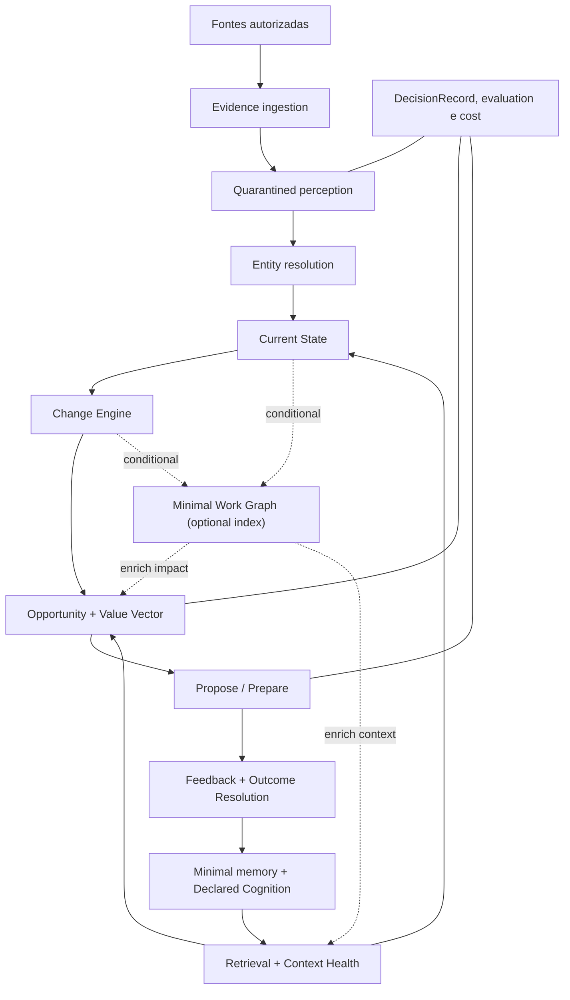
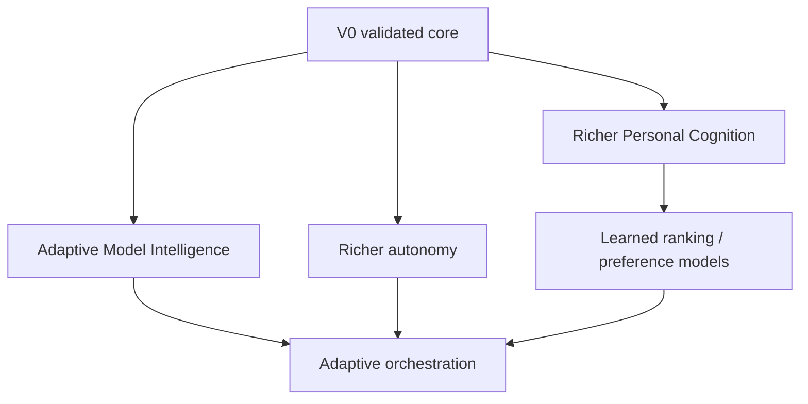

# Architecture Package v0.2 Final — Second Brain (placeholder)

**Status:** **FROZEN — baseline arquitetural oficial.** Reconciliado após revisão adversarial e verificado; liberado para Validation Sprint 0  
**Data:** 30 de agosto de 2026  
**Baseline preservada:** Architecture Package v0.1  
**Escopo:** produto, arquitetura conceitual, cognição, dados, validação, custo, segurança e evolução  
**Fora de escopo:** implementação, stack, infraestrutura física, naming definitivo e fine-tuning

> Este documento é autossuficiente. Ele substitui o v0.1 como orientação corrente, sem reescrever ou apagar o histórico do v0.1.

### Freeze note

- **Architecture Verification Review:** 21 PASS · 3 PARTIAL · 0 FAIL · verdict **READY WITH MINOR CORRECTIONS**.
- **Nenhum blocking issue** identificado para o início da Validation Sprint 0.
- **Duas correções editoriais incorporadas** nesta versão final: (1) Work Graph explicitado como índice opcional e condicional, fora do caminho principal da V0; (2) normalização de proveniência e status no ADR (ADR-20 e ADR-13).
- Esta versão é **congelada como baseline oficial**. Alterações arquiteturais futuras só devem ocorrer em resposta a evidência produzida pelos experimentos ou por meio de um novo ADR registrado.

## Convenções de leitura

- **DECISION:** escolha arquitetural provisória que governa a V0.
- **HYPOTHESIS:** afirmação ainda não comprovada que pode alterar ou matar o produto.
- **EXPERIMENT:** mecanismo de validação com critério definido antes do resultado.
- **TARGET:** capacidade futura condicional, sem obrigação para a V0.
- **ESTABLISHED / SUPPORTED / SPECULATIVE:** força ordinal de evidência, nunca probabilidade calibrada.

`raw_model_score`, quando existir, é telemetria de pesquisa. Ele não governa memória, priorização, autonomia ou ação.

---

## 1. Executive summary

Second Brain é um **sistema cognitivo pessoal orientado a mudanças**. Sua função é manter uma representação viva do trabalho, identificar deltas relevantes, entender o que eles afetam, proteger atenção e preparar trabalho antes de uma solicitação explícita.

Sua unidade central não é chat, tarefa, documento, agente ou vetor. É uma sequência verificável:

```text
Evidence → Current State → Change → Impact → Opportunity → Propose / Prepare
```

O v0.2 preserva evidência antes de inferência, retrieval seletivo, autonomia limitada e modelos substituíveis. A reconciliação operacional — arquitetura delta-centric, Low-Data First, V0 separada do TARGET, evidência ordinal, memória não recursiva, novos gates e apenas Observe/Propose/Prepare — está detalhada na seção 2.

### V0 em uma frase

**Uma fatia estreita, read-only, baseada em checkpoints, que reconstrói o estado de um contexto de trabalho, detecta mudanças, mostra poucas oportunidades e prepara artefatos reversíveis com evidência e saúde de contexto visíveis.**

### Target Architecture em uma frase

Evolução condicional com aprendizagem, ranking, autonomia e routing mais ricos, somente quando superarem o núcleo low-data.

### Gate atual

Nenhuma implementação deve começar antes do **Validation Sprint 0** demonstrar simultaneamente:

1. valor potencial de intervenções manuais;
2. viabilidade mínima de unificar as fontes escolhidas;
3. custo e latência compatíveis com um limite definido antecipadamente;
4. escopo de dados e privacidade aceitável;
5. pelo menos uma classe de mudança detectável com qualidade operacional.

## 2. What changed from v0.1

### Mudanças estruturais

- **Centro:** Change Engine; Work Graph vira índice de impacto.
- **Regime:** Core Learning low-data permanente; ML condicional e separado da V0.
- **Epistemologia:** evidência ordinal, memória não recursiva, DecisionRecord e Outcome Resolution.
- **Operação:** Entity Resolution, Context Health, Cost & Latency e quarantine viram gates.
- **Personalização:** Declared Cognition primeiro; hipóteses observadas têm autoridade limitada.
- **Simplificação V0:** três memórias, tempo mínimo, Value Vector + top-k, routing estático e apenas Observe/Propose/Prepare.

### Disposição das decisões do v0.1

| v0.1 | Status no v0.2 | Destino |
| --- | --- | --- |
| D-01 Evidence ledger | MAINTAINED | ADR-01, reforçada contra self-poisoning |
| D-02 limites sem distribuição prematura | MAINTAINED | ADR-03 |
| D-03 Work Graph operacional | MODIFIED | ADR-02; subordinado ao Change Engine e opcional, condicionado a EXP-04 |
| D-04 tipos de memória × temperatura | DEFERRED | V0 usa três classes mínimas |
| D-05 retrieval híbrido/graph-scoped | MODIFIED | ADR-08; alternativas viram experimento |
| D-06 Behavioral Model por hipóteses | MODIFIED | ADR-09 e ADR-10 |
| D-07 prever antes de observar | MAINTAINED | ADR-14, com Outcome Resolution |
| D-08 oportunidade separada de prioridade | MAINTAINED | ADR-11 |
| D-09 EAV | DEFERRED | top-k simples na V0; ADR-11 |
| D-10 autonomia por domínio/ação | MODIFIED | V0 com três verbos; matriz rica é TARGET |
| D-11 agents task-scoped | DEFERRED | agentes múltiplos são TARGET |
| D-12 routing simples na V0 | MAINTAINED | ADR-16 |
| D-13 geração e avaliação separáveis | MODIFIED | ADR-16; gates permanecem e segundo modelo só se justificar custo. Não é a origem do DecisionRecord (ADR-13) |
| D-14 contratos provider-neutral | MAINTAINED | ADR-16 |
| D-15 read-only e preparação reversível | MAINTAINED | ADR-12 |
| D-16 feedback explícito forte | MODIFIED | feedback bidimensional |
| D-17 inferências sensíveis protegidas | MAINTAINED | ADR-18 |
| D-18 fine-tuning fora da V0 | MAINTAINED | ADR-20 |
| D-19 bitemporalidade | MODIFIED | ADR-07; bitemporalidade plena é TARGET |
| D-20 cortes verticais | MODIFIED | Validation Sprint 0 precede qualquer corte construído |

## 3. Product thesis

### HYPOTHESIS — tese do produto

Uma pessoa que trabalha em múltiplas superfícies perde valor não apenas por esquecer tarefas, mas por precisar reconstruir contexto, detectar mudanças, entender propagação, perceber trabalho latente e decidir onde colocar atenção.

Second Brain pode reduzir esse custo ao manter uma representação temporal e baseada em evidência do trabalho e ao transformar deltas em intervenções úteis.

### Promessa de valor

> O sistema percebe o que mudou, mostra o que isso afeta e prepara o próximo movimento útil — sem exigir que a usuária primeiro transforme a necessidade em tarefa.

### Unidade de valor

Uma **intervenção cognitiva útil**, que pode:

- revelar uma mudança desconhecida;
- mostrar impacto ou propagação não percebidos;
- reconstruir contexto suficiente para decidir;
- antecipar uma preparação aproveitável;
- justificar que nada merece atenção agora.

### Hipóteses que podem matar ou redirecionar o produto

- **H-01:** um briefing ideal, produzido manualmente com acesso amplo, é valioso com frequência suficiente.
- **H-02:** sinais relevantes ficam disponíveis antes do momento em que a usuária já os percebe.
- **H-03:** fontes limitadas permitem reconstruir estado e delta sem manutenção manual excessiva.
- **H-04:** a personalização melhora o resultado acima de um baseline neutro.
- **H-05:** o custo por intervenção útil é aceitável.
- **H-06:** a proatividade não produz mais ruído, vigilância percebida ou correção do que valor.

A Validation Sprint 0 testa H-01, H-02, H-03 e H-05 antes da implementação. H-04 e H-06 exigem acompanhamento posterior.

## 4. North-star experience

Em um checkpoint escolhido — início do dia, antes de uma reunião importante ou retomada de projeto — a usuária recebe cinco blocos:

1. **What changed:** fatos e decisões que alteraram o estado.
2. **What you may not know yet:** mudanças provavelmente fora da atenção recente.
3. **What needs attention:** poucos itens, ordenados, com “por que agora”.
4. **What could be prepared:** trabalho reversível que pode ser adiantado.
5. **What can be ignored:** ruído descartado ou itens que podem esperar.

Cada item apresentado deve incluir, de forma proporcional ao risco:

- evidências usadas;
- força ordinal da evidência;
- estado das fontes relevantes;
- mudança detectada;
- impacto ou dependência afetada;
- política que decidiu mostrar;
- opção de corrigir o fato e avaliar separadamente o valor da entrega.

### Exemplo

> **Mudou:** a direção visual registrada na reunião de ontem difere do documento principal.  
> **Evidência:** ata da reunião + versão atual do documento. **SUPPORTED**.  
> **Impacto:** dois frames e uma apresentação dependem da direção anterior.  
> **Context Health:** reunião atualizada; Figma ainda não verificado.  
> **Proposta:** revisar os três impactos no próximo checkpoint. Um rascunho de comparação pode ser preparado sem publicação.

O sistema não precisa abrir um chat para produzir valor e não deve transformar cada observação em notificação.

## 5. Core principles

1. **Evidence before inference.** Evidência, afirmação derivada, estado, mudança, oportunidade, decisão e resultado são objetos diferentes.
2. **Delta-centric.** O valor primário nasce de detectar mudanças e propagação, não de responder perguntas sobre um corpus estático.
3. **Low-Data First.** O produto funciona mesmo se nunca houver dados para treinar modelos pessoais sofisticados.
4. **Declared first, inferred carefully.** Conhecimento declarado tem maior autoridade que inferência comportamental conflitante, até atualização explícita.
5. **Ordinal evidence, not fake probability.** Força de evidência não é confidence emitida pela LLM.
6. **Original evidence remains reachable.** Views e resumos são reconstruíveis e não corroboram a si mesmos.
7. **Change detection deterministic first.** Hashes, versões, chaves e diffs estruturados precedem interpretação por LLM.
8. **Untrusted content stays quarantined.** Conteúdo bruto de terceiros não entra no plano privilegiado como instrução.
9. **Attention is scarce.** Esperar e ignorar são decisões úteis.
10. **Preparation and presentation are independent.** Ter gasto recursos preparando algo não aumenta sua prioridade.
11. **Autonomy is explicit.** A V0 somente observa, propõe e prepara; nunca publica ou representa a usuária.
12. **Third parties are not modeled as persons.** O sistema representa posições e responsabilidades, não perfis comportamentais de colegas.
13. **Models are replaceable engines.** Memória, identidade, política, avaliação e lineage permanecem fora dos modelos.
14. **Every consequential decision is reconstructible.** DecisionRecord registra o que realmente aconteceu; explicação não é narrativa post-hoc.
15. **Context health limits assertiveness.** Cobertura insuficiente reduz claims ou força abstenção.
16. **Cost is architectural.** Processamento contínuo precisa provar valor e caber no orçamento.
17. **Logical modules are not microservices.** A V0 permanece conceitualmente modular e operacionalmente simples.
18. **Future capability creates no V0 obligation.** Target Architecture é condicional.

## 6. Non-goals

Second Brain não é:

- chatbot genérico;
- task manager completo;
- RAG sobre documentos;
- resumidor de Slack, e-mail ou reuniões;
- motor de notificações;
- orquestrador de agentes como produto;
- clone, personalidade ou representante autônomo da usuária;
- perfil psicológico da usuária ou de terceiros;
- mecanismo de monitoramento de performance de colegas;
- sistema que guarda toda a história no contexto da LLM;
- sistema que usa atividade, aceitação ou quantidade de sugestões como proxy suficiente de valor.

### Não-goals da V0

- execução externa ou publicação;
- ingestão de todas as fontes;
- streaming por padrão;
- PCM amplo;
- atenção em tempo real;
- agentes múltiplos;
- roteamento aprendido;
- reward model, fine-tuning, bandits ou learning-to-rank;
- bitemporalidade plena;
- taxonomia rica de memória;
- inferir princípios a partir de comportamento;
- contradição semântica como garantia.

## 7. Key lessons from adversarial review

1. **A ambição sobreviveu; a obrigação de implementação não.** Componentes futuros estavam misturados à V0.
2. **N=1 exige Core Learning permanente.** Muitos microeventos continuam correlacionados e causalmente ambíguos.
3. **Confidence de LLM não é evidência; memória derivada não é corroboração.** Sem essas duas correções, o rigor apenas amplifica erros.
4. **Valor e custo precisam de teto manual antes do build.** Sem briefing ideal e modelo econômico, não há arquitetura validada.
5. **Delta, identidade e saúde de contexto são pré-condições operacionais.** Eles tornam o sistema mensurável e diferente de RAG estático.
6. **Personalização começa no declarado; explicação começa no DecisionRecord.** Inferência e redação não podem inventar causalidade retroativa.

## 8. Validation Sprint 0

Gerar evidência de valor, viabilidade dos dados e custo antes de construir. É modelagem manual, não implementação. Antes dos estudos, escolher contexto/janela, definir “nova”, “acionável” e “aproveitável”, fixar limite de esforço e custo e registrar critérios de avanço/parada num DecisionRecord. Não há threshold universal nesta versão.

| Workstream | Pergunta e método | Saída | Decide |
| --- | --- | --- | --- |
| A. Retrospective Opportunity | reconstruir semanas reais e marcar delta, primeira detecção possível, percepção real, evidência e preparação útil | catálogo de deltas, janela de antecipação, replay temporal | plausibilidade proativa, fontes e classes V0 |
| B. Ideal Briefing | produzir manualmente os cinco blocos; avaliar correctness × value/timing; comparar cegamente com baseline simples | teto manual, “já sabia”, custo e vocabulário | proatividade, on-demand ou pivot |
| C. Declared Cognition | sessão editável sobre princípios, qualidade, preferências, limites, confirmações obrigatórias e proibições | bootstrap declarado versionado | personalização inicial |
| D. Cost & Latency | medir volume; estimar fração LLM, tokens, retries, latência e utilidade; comparar modos | custo diário/mensal, custo útil, P50/P95 | modo de processamento e pré-filtro |
| E. Entity Resolution | amostrar objetos cross-source; testar chaves, aliases e heurísticas; auditar merges | cobertura, ambiguidade e erros | fontes e limite do Work Graph |
| F. Auto-consistency | reapresentar escolhas reais com ordem/rótulos controlados | teto por categoria e pontos de abstenção | limites do PCM, nunca sua eliminação global |

### Gate de saída do sprint

| Resultado | Ação |
| --- | --- |
| briefing manual sem valor claro | pivotar ou encerrar a tese proativa |
| valor existe, mas sinal chega tarde | focar reconstrução e preparação sob demanda |
| valor e janela existem, mas fontes não resolvem entidades | trocar/reduzir fontes antes de construir |
| valor existe, custo incompatível | reduzir frequência, usar micro-batch/on-demand ou limitar escopo |
| valor, dados e custo são plausíveis | iniciar build sequence da seção 32 |

## 9. V0 system architecture

### DECISION — arquitetura lógica



Esses são limites conceituais dentro de um sistema simples. Não implicam microservices, filas, agentes permanentes ou bancos especializados.

**Caminho principal da V0.** O fluxo obrigatório é `Current State → Change Engine → Opportunity / Value`. O Work Graph não pertence a esse caminho: ele aparece apenas como **índice opcional de impacto e contexto**, no formato `Current State / Change → optional Work Graph → enrich Impact / Retrieval / Opportunity` (linhas tracejadas no diagrama). Consequentemente:

- o **Change Engine não depende do Work Graph** e opera integralmente sobre versões de State Objects, hashes, campos estruturados e diffs determinísticos;
- a **Opportunity Detection não depende obrigatoriamente do Work Graph**; relações simples e determinísticas — dependência declarada, referência direta entre artifacts, autoria, pertencimento a workstream — podem ser representadas sem justificar uma arquitetura de Work Graph;
- o Work Graph **entra somente se EXP-04 demonstrar ganho marginal suficiente** sobre retrieval híbrido e sobre regras diretas de dependência, conforme §13 e ADR-02/ADR-08;
- enquanto esse ganho não for demonstrado, qualquer enriquecimento de impacto permanece opcional e sua ausência não bloqueia nenhum estágio da V0.

### Componentes necessários

- Evidence ingestion;
- quarantined perception;
- Entity Resolution;
- Derived Assertions;
- Current State;
- Change Engine;
- minimal Work Graph — **conditional/experimental**, fora do caminho principal; só permanece no inventário se EXP-04 demonstrar ganho marginal suficiente;
- minimal memory;
- Declared Cognition;
- retrieval e Context Packet;
- Context Health;
- narrow Opportunity Detection;
- Value Vector;
- políticas investigate/show/prepare;
- Observe/Propose/Prepare;
- feedback bidimensional;
- DecisionRecord;
- Prediction e Outcome Resolution limitados;
- ModelRun logging, routing estático e Budget Controller;
- Cost & Latency tracking;
- evaluation e replay.

### Fluxo de uma intervenção

1. evento autorizado é registrado como evidência;
2. percepção quarentenada emite Derived Assertions estruturadas;
3. Entity Resolution liga objetos ou marca ambiguidade;
4. Current State aceita, rejeita ou supersede assertions;
5. Change Engine calcula delta, sem depender do Work Graph;
6. **opcionalmente**, quando o Work Graph existir e tiver demonstrado ganho, ele enriquece dependências e propagação; relações simples e determinísticas cumprem esse papel na sua ausência;
7. Opportunity Detection cria candidato estreito, com ou sem esse enriquecimento;
8. Value Vector registra fatores;
9. gates eliminam itens sem grounding, permissão, validade ou saúde suficiente;
10. políticas decidem investigar, mostrar e preparar de forma independente;
11. DecisionRecord congela evidência, fatores, versões e decisão;
12. feedback e outcome atualizam evidência de competência e hipóteses, nunca o fato original.

## 10. Delta / Change Engine

### DECISION — centro operacional da V0

O Change Engine responde:

- o que mudou desde o estado anterior?
- quando a mudança foi observada e, se conhecido, quando passou a valer?
- o que foi substituído ou invalidado?
- quais dependências podem ter sido afetadas?
- onde a mudança ainda não foi propagada?

### Entradas

- versões de State Objects;
- eventos normalizados;
- Derived Assertions aceitas;
- relações determinísticas de dependência e, **opcionalmente**, relações do minimal Work Graph quando ele existir — nenhuma das duas é pré-requisito para detectar delta;
- timestamps e `superseded_by`;
- Context Health.

### Tipos mínimos de mudança

- `created`;
- `modified`;
- `removed`;
- `status_changed`;
- `superseded`;
- `invalidated`;
- `dependency_impacted`;
- `not_propagated`;
- `unknown_change`.

### Ordem de detecção

1. comparação de IDs, hashes, versões e campos estruturados;
2. regras por tipo de objeto;
3. diff lexical;
4. interpretação semântica por LLM somente quando necessária;
5. revisão ou abstenção para mudanças de alto impacto e baixa evidência.

### Saída: Change Record

- objeto afetado;
- before/after ou referência às versões;
- tipo da mudança;
- `observed_at`;
- `effective_at?` e `effective_at_inferred`;
- evidências;
- força ordinal;
- dependências candidatas;
- `contradiction_flag`;
- Context Health no momento;
- mecanismo detector e versão.

Mudança semântica detectada por LLM começa como candidata. Ela não altera silenciosamente conhecimento estabilizado.

## 11. Evidence and quarantined ingestion

### Evidence spine

O sistema preserva:

- evento bruto ou ponteiro recuperável;
- fonte, autoria, audiência e workspace;
- timestamps da fonte e da ingestão;
- versão, hash e lineage;
- ACL, sensibilidade, propósito e retenção;
- `content_origin`: `user`, `third_party`, `source_system` ou `system`;
- estado de disponibilidade da fonte.

### Quarantined perception

Componentes que tocam conteúdo bruto de terceiros:

- não possuem capacidade de ação;
- não recebem grants de autonomia;
- não tratam texto ingerido como instrução privilegiada;
- emitem objetos estruturados validados;
- preservam citações como dados;
- marcam parsing incompleto, schema failure e conteúdo suspeito;
- não atualizam diretamente memória estabilizada.

O plano privilegiado recebe apenas objetos validados e referências necessárias. Quando nuance bruta for indispensável, o acesso deve ser explícito, limitado e registrado; não é um atalho silencioso.

### Corroboração proporcional ao risco

Não existe regra universal de duas fontes. O requisito depende de:

- tipo do claim;
- autoridade da fonte;
- risco da decisão associada;
- reversibilidade;
- possibilidade de confirmação determinística;
- existência de evidência da própria usuária.

Uma agenda criada pelo calendário pode ser ESTABLISHED com uma única fonte autoritativa. Uma suposta preferência inferida de uma fala de terceiro permanece SPECULATIVE e não entra no PCM.

### Proteção contra self-poisoning

Todo artefato produzido pelo sistema recebe `content_origin = system` e lineage do run. Se reaparecer numa fonte monitorada:

- não conta como evidência independente;
- não aumenta diversidade de fontes;
- não confirma o claim que o originou;
- pode servir como evidência de uso ou edição, desde que o comportamento seja registrado separadamente e sem causalidade presumida.

### Derived Assertion

Signal e Claim são unificados operacionalmente sem perder estágio epistemológico:

- `candidate`;
- `accepted`;
- `rejected`;
- `superseded`.

Uma Derived Assertion inclui evidências, estágio, força ordinal, escopo, mecanismo de extração, contraevidência e versão. Opportunity continua separado porque representa valor potencial e acionabilidade, não verdade.

## 12. Entity resolution

### DECISION — requisito anterior ao Work Graph

Entity Resolution liga representações da mesma pessoa, reunião, documento, projeto, decisão ou artifact entre fontes.

### Ordem de resolução

1. IDs e chaves determinísticas compartilhadas;
2. links, endereços, IDs de evento, referências e metadata estável;
3. aliases e heurísticas explícitas;
4. LLM como desempate, produzindo candidato, nunca merge definitivo de alto impacto;
5. revisão manual quando ambiguidade afeta estado ou atenção.

### Regras

- merges são reversíveis e auditáveis;
- nenhuma entidade perde seus source identifiers;
- split é operação de primeira classe;
- entidades não resolvidas permanecem distintas;
- resolução de pessoa não autoriza modelagem comportamental;
- confidence numérica de LLM não decide merge;
- conflito de identidade degrada Context Health.

### Métricas mínimas

- cobertura por chaves determinísticas;
- precisão de merges;
- taxa de falsos merges;
- taxa de entidades não resolvidas;
- merges revertidos;
- impacto de erros em deltas e briefings.

## 13. Current State + minimal Work Graph

### Current State

Current State é a melhor representação aceita, naquele momento, dos objetos necessários ao recorte da V0. Ele não é uma cópia completa das fontes nem uma verdade independente da evidência.

Objetos mínimos candidatos:

- workstream;
- goal;
- artifact;
- decision;
- commitment;
- question;
- risk;
- event;
- person/team apenas como ator, responsabilidade ou autoria.

Cada objeto mantém:

- source identifiers;
- estado e versão;
- `observed_at`;
- `effective_at?`;
- `effective_at_inferred`;
- `superseded_by?`;
- evidências e Derived Assertions associadas;
- força ordinal;
- ACL e sensibilidade;
- Context Health relevante.

### Minimal Work Graph

O Work Graph é uma projeção de relações úteis para:

- “depende de”;
- “é parte de”;
- “decidido em”;
- “produz/atualiza”;
- “responsável por”;
- “afeta”;
- “substitui”;
- “contradiction candidate”.

Ele não precisa de tecnologia de grafo e não organiza tudo que o sistema sabe. Sua existência na V0 depende de demonstrar ganho sobre retrieval lexical/semantic simples ou sobre regras diretas de dependência.

### Condicionalidade do Work Graph

O Work Graph é uma **projeção subordinada e opcional**, nunca um componente do caminho principal:

- o **Change Engine não depende dele**: delta é calculado a partir de versões, hashes, campos estruturados e diffs determinísticos;
- a **Opportunity Detection não depende obrigatoriamente dele**: relações simples e determinísticas — dependência declarada, referência direta, autoria, pertencimento a workstream — cobrem os casos iniciais sem exigir uma arquitetura de grafo;
- sua função é **enriquecer impacto, retrieval e oportunidade**, não gerar mudança nem sustentar verdade;
- ele **só é adotado se EXP-04 demonstrar ganho marginal suficiente** sobre o baseline híbrido, medido contra o custo de construção e manutenção;
- até lá permanece marcado como **conditional/experimental** no inventário de componentes da V0 (§9) e no Build Stage 3 (§32);
- a existência de relações úteis no domínio não é, por si só, justificativa para uma arquitetura de Work Graph.

O conceito permanece no documento como opção arquitetural avaliada, não como obrigação da V0.

### Regra de atualização

Nenhuma relação inferida de alto impacto é aceita sem evidence span, mecanismo de derivação e possibilidade de reversão. O Change Engine consome estado; o grafo ajuda a propagar impacto. O grafo não gera mudança por conta própria.

## 14. V0 memory architecture

### DECISION — três classes mínimas

1. **Episodic / evidence-backed memory:** eventos, decisões e mudanças situadas no tempo, sempre ligadas à fonte.
2. **Stabilized semantic knowledge:** fatos e relações que passaram por regras de promoção e continuam apontando para evidência original.
3. **Declared Cognition:** princípios, critérios, preferências, limites e regras explicitamente declarados ou confirmados pela usuária.

Memória procedural, preference memory inferida, judgment memory, hot/warm/cold sofisticado e consolidação multinível são TARGET, não V0.

### Promoção para conhecimento estabilizado

Depende de:

- autoridade e tipo da fonte;
- diversidade real de evidência, quando necessária;
- escopo e temporalidade;
- ausência de conflito material não resolvido;
- risco de aplicar o conhecimento incorretamente;
- Context Health suficiente;
- `origin` que não represente autocorroboração do sistema.

Quantidade de repetições não é, sozinha, corroboração. O mesmo conteúdo copiado para três fontes continua tendo uma origem causal.

### Consolidação sem deriva recursiva

- resumo de resumo não serve como evidência;
- derived summaries são views ou caches reconstruíveis;
- toda view aponta diretamente para evidência de nível zero ou conhecimento estabilizado apoiado nessa evidência;
- uma view não aumenta força de evidência;
- views geradas pelo sistema carregam `content_origin = system`;
- retrieval não pode contar view e fontes subjacentes como evidências independentes;
- correções invalidam e reconstroem views dependentes;
- degradação por consolidação é medida antes de ativar uso recorrente.

### Decay baseado em oportunidade

- passagem do tempo não invalida Declared Cognition;
- ausência de um contexto aplicável não conta como contraevidência;
- hipótese observada perde relevância somente quando surgem oportunidades comparáveis sem confirmação, contraevidência ou mudança explícita de escopo;
- fatos temporários expiram por regra do domínio, não por “esquecimento” genérico;
- conhecimento superseded permanece no histórico e sai do Current State.

## 15. Retrieval and Context Packet

### Objetivo

Montar o menor contexto suficiente para interpretar uma mudança ou produzir uma intervenção, sem apagar contraevidência, temporalidade ou restrições de acesso.

### Pipeline V0

1. definir tarefa, workstream, entidades e janela temporal;
2. aplicar ACL, sensibilidade, origem e freshness;
3. gerar candidatos por lexical retrieval;
4. gerar candidatos semânticos quando permitido;
5. expandir por relações somente quando o Work Graph demonstrar ganho;
6. buscar versões superseded e contradiction flags relevantes;
7. ordenar por relevância, autoridade, validade e diversidade;
8. montar Context Packet;
9. calcular Context Health;
10. responder, recuperar mais ou abster-se.

### Context Packet

- objetivo da execução;
- Current State relevante;
- Change Records;
- decisões e compromissos válidos;
- Declared Cognition aplicável;
- evidência original alcançável;
- contraevidência e contradiction flags;
- lacunas conhecidas;
- Context Health;
- política, budget e limite de ação;
- itens excluídos por permissão ou orçamento, sem revelar conteúdo proibido.

### Baselines obrigatórios

- lexical;
- semantic;
- hybrid;
- graph-scoped apenas se justificar manutenção.

Embeddings, se utilizados, mantêm modelo, versão, data, dimensão e estratégia de chunking. Reindexação precisa ser possível. Embeddings não são memória autoritativa e não devem ser a única rota de recuperação.

### Avaliação

O mecanismo escolhido deve demonstrar ganho em suficiência, precisão, evidência alcançável e custo. Testes de ablação verificam se itens do Context Packet contribuem para o resultado ou apenas consomem tokens.

## 16. Context Health

### DECISION — saúde de contexto como entrada de política

Context Health descreve cobertura e confiabilidade operacional do contexto, não a certeza semântica de um claim.

### Dimensões

- fontes esperadas disponíveis;
- freshness por fonte;
- cobertura temporal;
- sucesso de ingestão;
- Entity Resolution pendente;
- artifacts sem versão atual;
- contradiction flags não resolvidas;
- permissões que impedem cobertura;
- falhas de parsing ou schema;
- lineage incompleto.

### Estado agregado

- **HEALTHY:** cobertura necessária presente para aquela tarefa;
- **DEGRADED:** lacunas conhecidas permitem saída limitada com aviso;
- **INSUFFICIENT:** lacunas podem alterar materialmente o resultado; abster ou perguntar.

O agregado é específico da tarefa. Calendário indisponível pode ser irrelevante para comparar duas versões de documento e crítico para preparar uma reunião.

### Comportamento degradado

- reduzir assertividade;
- impedir promoção de conhecimento;
- bloquear preparação dependente de fonte ausente;
- exibir lacuna e última atualização;
- evitar fallback silencioso para memória antiga;
- registrar abstenção no DecisionRecord.

## 17. Opportunity detection

### DECISION — escopo estreito

Opportunity é uma possibilidade de criar valor ou evitar perda que ainda não virou trabalho explícito. Ela permanece separada de Derived Assertion porque oportunidade não é claim sobre verdade; é hipótese de acionabilidade.

As classes da V0 serão escolhidas pelo Validation Sprint. Candidatas iniciais:

- decisão nova não propagada a artifact dependente;
- compromisso ou evento próximo que exige preparação;
- mudança que invalida trabalho existente;
- pergunta relevante sem owner ou resolução;
- risco explícito cuja janela de mitigação está fechando.

### Opportunity Candidate

- Change Record ou evidência de origem;
- goal/workstream relacionado;
- impacto e dependências;
- possível beneficiário;
- janela temporal;
- ação mínima possível;
- esforço aproximado;
- reversibilidade;
- força de evidência;
- Context Health;
- `origin` e risco de self-poisoning;
- estado: candidate, investigated, proposed, prepared, accepted, rejected, expired.

### Limites

- plausibilidade não basta para mostrar;
- o sistema pode investigar sem promover;
- oportunidade expira ou é resolvida;
- detectar tarefa explícita não conta como Opportunity Intelligence;
- quantidade de oportunidades detectadas não é métrica de sucesso.

## 18. Value Vector and policies

### DECISION — fatores únicos, políticas separadas

O Value Vector registra fatores compartilhados uma única vez. Ele não é necessariamente uma fórmula escalar e não contém confidence probabilística inventada.

### Fatores V0

- alignment: relação com objetivo/responsabilidade;
- consequence: valor habilitado ou perda evitada;
- time_sensitivity: janela e custo de esperar;
- evidence_strength: ESTABLISHED/SUPPORTED/SPECULATIVE;
- context_health: HEALTHY/DEGRADED/INSUFFICIENT;
- novelty: nova, já conhecida ou incerta;
- actionability: existe próximo passo concreto?;
- effort: baixo/médio/alto, com origem da estimativa;
- reversibility: reversível, compensável ou irreversível;
- permission_scope;
- preparation_cost;
- dependency_reach;
- sensitivity/risk.

Cada fator registra origem: determinístico, declarado, regra ou inferido.

### Políticas

1. **Investigate policy:** vale gastar recursos para reduzir incerteza?
2. **Show policy:** merece um lugar no próximo checkpoint?
3. **Prepare policy:** vale criar artifact reversível antes de confirmação?

Quality gates permanecem separados:

- grounding;
- permission;
- temporal validity;
- security;
- Context Health mínimo.

### Attention V0

Após gates, usar filtro simples e top-k no checkpoint. Sem EAV sofisticado, budgets por canal ou interrupção em tempo real.

### Preparation bias

- `prepared = true` não participa da Show Policy;
- custo já gasto não aumenta consequência, novidade ou time sensitivity;
- decisão de preparar e decisão de mostrar geram DecisionRecords distintos;
- medir total preparado, total mostrado, total usado, total expirado e custo desperdiçado;
- um artifact pode ser descartado sem ser mostrado.

## 19. Declared Cognition

### DECISION — bootstrap e maior autoridade

Declared Cognition contém somente itens explicitamente informados ou posteriormente confirmados pela usuária:

- princípios;
- critérios de qualidade;
- preferências contextuais;
- formatos e profundidade preferidos;
- limites de autonomia;
- ações que sempre exigem confirmação;
- assuntos que nunca devem ser inferidos;
- exemplos positivos, negativos e exceções.

### Registro mínimo

- declaração original;
- `knowledge_origin = declared`;
- categoria declarada;
- contexto e audiência;
- exemplos;
- exceções;
- `declared_at`;
- versão;
- status: active, superseded, revoked;
- fonte direta;
- escopo de aplicação.

### Precedência

Quando uma hipótese observada conflita com Declared Cognition:

- a hipótese não sobrescreve a declaração;
- o conflito é registrado;
- o sistema pode perguntar quando a diferença for recorrente e material;
- somente confirmação ou atualização explícita altera o conhecimento declarado.

Isso não torna declarações eternamente “verdadeiras”; torna sua autoridade e atualização auditáveis.

## 20. Behavioral hypotheses

### Papel na V0

A V0 pode registrar Raw Behavioral Observations e formar hipóteses conservadoras em shadow mode. Essas hipóteses:

- não viram princípios;
- não governam autonomia;
- não superam Declared Cognition;
- não ganham autoridade por simples repetição de output do sistema;
- não são aplicadas fora do contexto observado;
- podem sugerir uma pergunta ou alimentar avaliação offline;
- precisam registrar alternativas disponíveis.

### Estrutura

- descrição falsificável;
- `knowledge_origin = observed`;
- contexto;
- evidências e diversidade de situações;
- contraevidências;
- oportunidades de confirmação observadas;
- alternativas apresentadas;
- possível confounder;
- estado: candidate, supported, contradicted, expired, confirmed;
- força ordinal;
- custo de aplicação incorreta.

Exemplo aceitável:

> Em situações observadas onde incerteza competitiva afetava uma decisão ativa, benchmark foi iniciado com frequência.

Exemplo proibido sem declaração:

> A usuária tem como princípio sempre fazer benchmark diante de incerteza competitiva.

### Communication adaptation vs. impersonation

O sistema pode adaptar estrutura, densidade, profundidade, formato e nível de evidência. Não pode autonomamente copiar identidade/voz para se passar pela usuária ou enviar conteúdo como se fosse ela.

## 21. Low-data learning architecture

### Trilha 1 — Core Learning permanente

Funciona em qualquer volume de dados:

- Declared Cognition;
- feedback explícito;
- Behavioral Hypotheses;
- regras e estatística descritiva simples;
- retrieval contextual;
- evidência e contraevidência;
- replay temporal;
- DecisionRecords;
- outcomes resolvidos;
- Competence Store com `n` visível.

### Trilha 2 — Statistical/ML Learning condicional

Pode incluir:

- learning-to-rank;
- preference models;
- reward models;
- fine-tuning;
- contextual bandits;
- roteamento aprendido.

Essa trilha só entra se houver:

- tarefa estável;
- amostra suficiente por contexto relevante;
- outcome resolvido e rótulo confiável;
- split temporal sem leakage;
- baseline Core Learning forte;
- ganho fora da amostra;
- custo e privacidade aceitáveis;
- rollback e monitoramento.

### Autoridade de aprendizagem

```text
Declared Cognition
        ↓ maior autoridade
Confirmed Personal Knowledge
        ↓
Behavioral Hypotheses
        ↓ autoridade limitada
Raw Behavioral Observations
```

Muitos microeventos não equivalem automaticamente a muitas amostras independentes. Eventos correlacionados, outputs gerados pelo sistema e escolhas sem alternativas adequadas devem ser marcados como tal.

## 22. DecisionRecord and explainability

### DECISION — objeto de primeira classe

DecisionRecord registra uma decisão do sistema: aceitar assertion, atualizar estado, investigar, mostrar, preparar, abster, selecionar modelo ou bloquear ação.

### Campos mínimos

- decision type e outcome;
- timestamp;
- input object IDs;
- evidências realmente usadas;
- Change Records relevantes;
- Value Vector calculado;
- gates executados e resultados;
- política aplicada e versão;
- Context Health;
- Declared Cognition ou hipótese pessoal usada;
- modelo, prompt e versão;
- custo e latência;
- alternativas consideradas;
- erro, fallback ou abstenção;
- links para ModelRun/ToolRun/Artifact.

### Explicação

A explicação apresentada à usuária é uma transformação do DecisionRecord. Uma LLM pode melhorar redação e compressão, mas:

- não adiciona motivo ausente no registro;
- não altera força da evidência;
- não esconde source health degradado;
- não substitui policy result por narrativa persuasiva;
- deve permitir drill-down até evidência original.

## 23. Feedback model

### Dimensão 1 — Epistemic correctness

- `correct`;
- `partially_correct`;
- `incorrect`;
- `not_verifiable`.

### Dimensão 2 — Delivery/value

- `valuable`;
- `already_known`;
- `irrelevant`;
- `too_early`;
- `too_late`.

As dimensões são independentes. Um item pode ser correto e irrelevante, ou parcialmente correto e ainda valioso.

### Feedback de artifacts preparados

- used_as_is;
- used_after_edit;
- not_used;
- not_shown;
- expired;
- replaced;
- reason, quando explicitamente informado.

### Regras de aprendizagem

- “não útil” não penaliza automaticamente percepção;
- silêncio e demora são evidências fracas e ambíguas;
- edição não revela causa sem contexto;
- escolher a menos ruim não significa preferência positiva;
- exigir stakeholder ou prazo não vira preferência pessoal;
- feedback sobre conteúdo do sistema não cria corroboração do fato original;
- correções propagam para assertions, state, views e avaliações dependentes.

## 24. Prediction and Outcome Resolution

### Previsões na V0

Registrar apenas previsões com outcome observável e utilidade de aprendizagem clara, como:

- artifact preparado será usado?;
- item mostrado será novo e valioso?;
- oportunidade será aceita, rejeitada ou expirada?;
- mudança candidata será confirmada ou rejeitada?

Não criar previsões abstratas sobre “o que a usuária faria” sem evento de resolução definido.

### Prediction Record

- pergunta prevista;
- alternativas disponíveis;
- categoria e contexto;
- evidência usada;
- força ordinal, não probabilidade inventada;
- versão da política/PCM;
- `predicted_at`;
- janela de resolução;
- resolver esperado.

### Outcome Resolution Engine

Toda previsão termina em:

- `resolved`;
- `unresolved`;
- `expired`;
- `ambiguous`.

O resolver usa eventos determinísticos quando possível e revisão explícita quando necessário. Outcomes não observados não são convertidos em rejeição ou confirmação.

### Métricas

- taxa de resolução;
- taxa `unresolved`;
- taxa `ambiguous`;
- tempo até resolução;
- erro por categoria;
- cobertura de outcomes;
- divergência entre outcome automático e revisão.

Previsão continua sendo registrada antes do outcome. Sem isso, não há evidência de aprendizagem, apenas racionalização.

## 25. Model Intelligence V0

### DECISION — configuração simples e provider-neutral

V0 contém:

- mapa versionado `task archetype → primary model + fallback`;
- requisitos por modalidade e tool use;
- política de dados permitidos por provedor;
- Budget Controller simples;
- ModelRun estruturado;
- replay set para comparação periódica;
- Competence Store único.

Não contém router aprendido, ensemble padrão, debate multi-agent ou seleção dinâmica por reward model.

### ModelRun

- task archetype;
- provider/model/version;
- prompt/policy version;
- contexto e tokens;
- tools;
- custo e latência;
- structured output validity;
- evaluator result;
- outcome quando resolvido;
- fallback/retry;
- dados redigidos ou enviados.

### Competence Store

- task archetype;
- contexto;
- model/prompt/version;
- tipo de avaliação;
- desempenho observado;
- tamanho da amostra `n`;
- intervalo temporal;
- falhas graves;
- última comparação com baseline.

Ele unifica metacognição operacional, Performance Store e Routing Evaluator. Um registro com `n` pequeno não vira conclusão geral.

### Independência cognitiva

- estado e memória fora do modelo;
- outputs estruturados e contratos versionados;
- prompts, policies e evals próprios;
- embeddings versionados e reindexáveis;
- capacidade de replay;
- fallback sem reconstruir o modelo pessoal.

## 26. Cost & Latency model

### DECISION — gate bloqueante antes da implementação

O modelo usa dados observados no Validation Sprint. Nenhum número é assumido como fato nesta versão.

### Inputs por fonte e arquétipo

- eventos/dia `E_s`;
- fração que passa pelo pré-filtro `f_filter`;
- fração processada por LLM `f_llm`;
- chamadas por item `c_a`;
- tokens de entrada `T_in,a`;
- tokens de saída `T_out,a`;
- preço por token do modelo selecionado;
- retry/reprocessing multiplier `r_a`;
- taxa de cache hit, se aplicável;
- latência P50/P95;
- evaluator/shadow sampling rate;
- número de intervenções úteis resolvidas.

### Cálculos mínimos

Para cada arquétipo `a`:

```text
calls_a/day = eligible_items_a × c_a × (1 + r_a)

token_cost_a/day = calls_a/day ×
  ((T_in,a × input_price_a) + (T_out,a × output_price_a))

total_cost/day = Σ token_cost_a + tool/storage/connector costs

cost/useful_intervention = total_cost / resolved_useful_interventions
```

Custos de desenvolvimento não devem ser misturados com custo operacional, mas ambos precisam aparecer na decisão de viabilidade.

### Modos comparados

| Modo | Benefício | Custo/risco | Papel na V0 |
| --- | --- | --- | --- |
| streaming | menor latência | custo contínuo, alta complexidade e pouco consumidor | não recomendado sem caso urgente provado |
| micro-batch por checkpoint | alinha computação à experiência | atraso entre eventos e checkpoint | recomendação provisória |
| on-demand | menor custo e maior controle | não antecipa sem gatilho | complemento para drill-down e tarefas caras |

### Budget Controller V0

- teto por checkpoint/dia/mês;
- limite de retries;
- amostragem de evaluator e shadow;
- fallback mais barato;
- bloqueio de processamento de baixo valor;
- registro de custo desperdiçado em artifacts não usados;
- alerta quando custo por intervenção útil excede o limite definido no sprint.

### Latência

Medir:

- tempo de ingestão até disponibilidade;
- tempo de checkpoint até briefing;
- P50/P95 por arquétipo;
- caminho crítico;
- atraso causado por fonte indisponível;
- trade-off entre batch size, freshness e custo.

## 27. Evaluation architecture

### Camadas

| Camada | Questão | Métricas adequadas à V0 |
| --- | --- | --- |
| ingestion | capturou conteúdo, versão e ACL? | completude, duplicação, freshness |
| entity resolution | ligou objetos corretamente? | precision, false merge, unresolved |
| derived assertions | extraiu sem inventar? | correção por classe, schema validity |
| change | detectou delta correto? | precision/recall por tipo, timing |
| state/memory | preservou escopo e evidência? | distorção, supersessão correta |
| retrieval | trouxe contexto suficiente? | comparação pareada, evidence reachability |
| context health | sinalizou lacunas? | falhas detectadas, abstenção adequada |
| opportunity | encontrou valor latente? | contagem absoluta útil, novidade, antecedência |
| show policy | promoveu os itens certos? | top-k útil, “já sabia”, falsos negativos graves |
| prepare policy | preparou trabalho aproveitável? | uso sobre total preparado, custo desperdiçado |
| personalization | superou baseline neutro? | comparação cega por categoria |
| model/cost | escolha justificou custo? | qualidade, custo, latência, `n` |

### Quality gates

- grounding;
- permission;
- temporal validity;
- security;
- Context Health;
- structured output validity.

Gates não são scores de valor. Um segundo modelo evaluator é usado somente quando o ganho justificar custo e quando não for o único controle de segurança.

### Métodos adequados a poucos dados

- replay temporal;
- comparação pareada cega;
- contagens absolutas;
- análise de falhas graves;
- ablation tests;
- casos construídos manualmente;
- revisão amostral humana;
- avaliação por categoria, sempre exibindo `n`;
- critérios definidos antes do resultado.

### Proteção contra viés de avaliação

- separar criação do artifact e rotulagem quando possível;
- ocultar origem do método em comparações;
- incluir baseline simples;
- registrar mudança de critério;
- não usar “aceitou” como sinônimo de “foi valioso”;
- usar revisão externa amostral para claims arquiteturais importantes;
- não transformar satisfação da pessoa investida no projeto em única métrica.

## 28. Security, privacy and third-party boundaries

### Fronteiras

1. **Fonte externa:** conteúdo pode ser falso, malicioso, desatualizado ou fora de propósito.
2. **Quarantined plane:** interpreta conteúdo bruto sem ferramentas ou autoridade.
3. **Privileged cognition:** usa objetos validados, policies e Context Packets limitados.
4. **Preparation plane:** cria apenas artifacts reversíveis e não publicados.
5. **Provider boundary:** recebe somente dados necessários e permitidos.

### Controles mínimos

- menor privilégio e purpose limitation por fonte;
- ACL propagada para assertions, state, memory, context e artifacts;
- separação entre workspace profissional e contexto pessoal;
- classificação de sensibilidade;
- conteúdo ingerido tratado como dado, não policy;
- schema validation e quarantine de payloads suspeitos;
- testes de prompt injection antes de conectar fontes de terceiros;
- lineage de outputs do sistema;
- logs de acesso, DecisionRecords e deleção;
- secrets fora de prompts e artifacts;
- retenção e exclusão em cascata verificável;
- capacidade de suspender fonte ou processamento;
- redaction/minimization antes de enviar a modelo externo;
- policy de provedor por sensibilidade e modalidade.

### Dados comportamentais de terceiros

O sistema pode registrar:

- declaração atribuída;
- posição em uma decisão;
- responsabilidade;
- compromisso;
- autoria;
- interação necessária para reconstruir o trabalho.

O sistema não pode criar para colegas:

- PCM;
- PreferenceHypothesis;
- traços persistentes;
- previsões comportamentais pessoais;
- ranking de confiança, cooperação ou performance.

Relações de trabalho não viram perfis de pessoas. Uma frase como “stakeholder X rejeitou a alternativa Y nesta reunião” pode ser evidência episódica; “X sempre rejeita inovação” é uma inferência comportamental proibida.

### Dados do Personal Cognition Model

Declared Cognition, observações comportamentais e hipóteses pessoais são altamente sensíveis. Precisam ser:

- visíveis e corrigíveis;
- exportáveis e deletáveis;
- separadas de dados organizacionais quando necessário;
- usadas somente para finalidade declarada;
- excluídas de treinamento de terceiros sem opt-in explícito;
- protegidas contra acesso por agentes/workers sem necessidade.

### Ação e identidade

Na V0 não há publicação, envio, edição externa ou impersonation. Artifact preparado deve ser claramente marcado como rascunho do sistema e exigir ação humana para sair do ambiente controlado.

## 29. V0 conceptual data model

| Domain | Objects |
| --- | --- |
| evidence/identity | Source, RawEvent, EvidenceSpan, Entity, EntityMerge |
| cognition/state | DerivedAssertion, StateObject, ChangeRecord, Relationship, MemoryView, DeclaredCognition, BehavioralObservation, BehavioralHypothesis |
| opportunity/decision | Opportunity, ValueVector, ContextPacket, ContextHealth, DecisionRecord, SystemArtifact |
| learning/operation | Feedback, Prediction, Outcome, ModelRun, CompetenceRecord |

Campos transversais aplicáveis: stable ID, source IDs, `content_origin`, lineage, ACL, sensibilidade, version, stage/status, evidence links, strength, scope e retention. Conhecimento pessoal usa separadamente `knowledge_origin = declared | observed`. Objetos temporais usam `observed_at`, `effective_at?`, `effective_at_inferred` e `superseded_by?`; `created_at/updated_at` são apenas operacionais.

### Força de evidência ordinal

- **ESTABLISHED:** evidência direta ou fonte autoritativa adequada ao claim; inclui Declared Cognition dentro do escopo declarado.
- **SUPPORTED:** evidência clara, porém incompleta, singular ou com dependência interpretativa.
- **SPECULATIVE:** inferência plausível que exige confirmação, contexto adicional ou observação futura.

Regras por classe definem os níveis. Composição nunca aumenta força; derivados herdam no máximo o elo mais fraco relevante.

## 30. Target Architecture

### TARGET — capacidades condicionais



Podem existir futuramente:

- PCM com submodelos de relevância, qualidade, timing e decisão;
- behavioral learning aplicado proporcionalmente ao risco;
- learned retrieval/ranking;
- advanced attention e interrupção contextual;
- matriz rica de autonomia por domínio, ação e audiência;
- multi-agent execution task-scoped;
- Model Intelligence com routing adaptativo;
- personal quality evaluator ou reward model;
- fine-tuning de tarefas específicas;
- contextual bandits sob exploração segura;
- bitemporalidade plena;
- memória procedural e de julgamento;
- richer opportunity discovery;
- execução externa com grants, preview, idempotência e rollback.

### Condições de entrada

Nenhuma capacidade TARGET entra porque “faz sentido arquiteturalmente”. Cada uma exige:

- caso de uso real;
- dataset e outcome compatíveis;
- baseline V0;
- avaliação offline e shadow;
- ganho proporcional ao custo;
- privacy review;
- política de rollback;
- observabilidade e owner.

Agentes continuam workers, não memória, identidade ou autoridade. A expansão futura não transforma o produto em orquestrador de agentes.

## 31. ML evolution gates

| Gate | Pergunta | Evidência exigida | Se falhar |
| --- | --- | --- | --- |
| ML-0 task stability | a tarefa é repetível e bem definida? | schema/outcome estáveis ao longo do tempo | manter regra/retrieval |
| ML-1 data quality | observações têm contexto, alternativas e origem? | auditoria de labels e dependência | não treinar |
| ML-2 sample sufficiency | existe amostra útil por categoria/contexto? | `n`, diversidade e distribuição | manter Core Learning |
| ML-3 resolvability | outcomes são resolvidos com baixa ambiguidade? | taxa unresolved/ambiguous aceitável | melhorar resolver |
| ML-4 baseline | ML supera regra/declarado/retrieval? | comparação temporal fora da amostra | rejeitar ML |
| ML-5 value | ganho importa para a experiência? | utilidade, erro grave, custo | não ativar |
| ML-6 safety | exploração e erro cabem no risco? | shadow, guardrails, rollback | restringir ou bloquear |
| ML-7 maintainability | drift e troca de modelo são operáveis? | monitoramento e plano de recalibração | não promover |

### Aplicações candidatas e ordem

1. pré-filtro barato de eventos;
2. Entity Resolution heurística/estatística;
3. retrieval/ranking;
4. personal preference learning por categoria;
5. model routing;
6. personal quality/reward model;
7. fine-tuning.

A ordem é indicativa, não roadmap. A primeira aplicação que provar valor pode ser diferente. Fine-tuning continua sem lugar presumido.

## 32. Build sequence after Validation Sprint

| Stage | Scope | Exit criterion |
| --- | --- | --- |
| 1. Evidence | um workstream; poucas fontes; origin/ACL/freshness; quarantine; Entity Resolution; custo real | replay de evidência correto, sem ações ou consolidação |
| 2. State + Change | objetos mínimos, timestamps V0, diffs determinísticos, revisão semântica | deltas do replay detectados com erros auditáveis |
| 3. Briefing | retrieval baseline, Context Packet/Health, cinco blocos, feedback; grafo mínimo **conditional/experimental**, incluído apenas se EXP-04 demonstrar ganho marginal suficiente | valor acima do baseline no recorte acordado, sem depender do grafo |
| 4. Opportunity | até três classes, Value Vector, investigate/show, top-k, DecisionRecord/outcome | utilidade, ruído e custo dentro dos gates prévios |
| 5. Prepare | um artifact reversível, policy independente, tracking total, content_origin=system | aproveitamento e desperdício conhecidos |
| 6. Core Learning | Declared Cognition, hipóteses em shadow, Prediction/Outcome limitado, Competence Store | personalização vence baseline neutro em pelo menos uma categoria |

### Regra de expansão

Adicionar uma fonte, classe de oportunidade ou nível de autonomia por vez. Nenhum estágio exige terminar toda a arquitetura horizontal antes de mostrar valor.

## 33. Architectural risks

| Risk | Failure mode | V0 mitigation | Kill/pivot signal |
| --- | --- | --- | --- |
| teto de valor baixo | briefing ideal não ajuda | Sprint 0 manual | pouco conteúdo novo/acionável segundo critério prévio |
| signal latency | sistema descobre depois da usuária | retrospective timing | janela de antecipação inexistente |
| entity resolution failure | objetos e deltas são ligados errado | deterministic-first, reversible merge | fonte depende majoritariamente de merge ambíguo |
| memory poisoning | derivado errado se estabiliza | depth=1, origin, evidence reachability | claim sem fonte original |
| prompt injection | conteúdo altera cognição/ação | quarantine, schema, adversarial test | payload chega ao estado privilegiado |
| self-poisoning | output do sistema confirma a si mesmo | content_origin=system e lineage | diversidade artificial de evidência |
| context degradation | briefing assertivo com fonte atrasada | Context Health e abstention | falha oculta de fonte |
| proactivity noise | checkpoint vira inbox | filtro + top-k | aumento de irrelevante/já sabia |
| preparation sunk cost | sistema mostra o que já gastou | policies independentes | show correlaciona com custo já gasto |
| false personalization | comportamento circunstancial vira regra | declared precedence, shadow hypotheses | correções recorrentes por contexto |
| closed choice loop | sistema aprende só de próprias opções | neutral baseline, alternatives log | preferência desaparece com opções externas |
| third-party profiling | colegas viram modelos comportamentais | boundary explícita | hipótese pessoal sobre terceiro |
| fake confidence | score do modelo controla decisão | ordinal evidence | raw_model_score usado por policy |
| outcome ambiguity | previsão nunca resolve | Outcome Resolution | unresolved/ambiguous domina |
| cost explosion | processamento escala com fontes | micro-batch, prefilter, budget | custo/intervenção excede limite |
| evaluator bias | judge premia estilo próprio | blind pairs, baseline, human sample | divergência sistemática com outcome |
| vendor lock-in | troca perde memória/quality | contracts, replay, versioned embeddings | estado depende de formato proprietário |
| ontology rigidity | objetos não cobrem trabalho real | minimal schema, versioning | correção manual/“other” domina |
| surveillance perception | observação reduz confiança | purpose, visibility, deletion | usuária evita fontes ou comportamento |

## 34. Open questions

### Bloqueantes antes de build

1. Qual workstream oferece sinal suficiente sem expor contexto excessivo?
2. Qual é o teto de custo aceitável por intervenção útil?
3. Qual janela histórica representa trabalho real e pode ser usada no sprint?
4. Quais fontes compartilham IDs ou links suficientes para Entity Resolution?
5. Qual quantidade e tipo de novidade justificam proatividade em checkpoints?
6. Quais dados organizacionais podem ser processados por quais provedores?

### Importantes para V0

7. Quais três classes de delta têm maior valor e melhor detectabilidade?
8. Qual checkpoint entrega valor: diário, por reunião, por retomada ou combinação?
9. Qual um tipo de artifact é barato, reversível e frequentemente aproveitável?
10. Como a usuária quer revisar Declared Cognition sem administrar um banco de dados sobre si mesma?
11. Qual Context Health mínimo é suficiente por classe de intervenção?
12. Quando uma mudança semântica pode atualizar Current State sem confirmação?
13. Quais contradiction flags determinísticos valem implementar?
14. Quanto detalhe do DecisionRecord deve aparecer por padrão?

### Target Architecture

15. Quais categorias de escolha têm auto-consistência suficiente?
16. Que outcomes aparecem em volume suficiente para ML?
17. Quando uma Behavioral Hypothesis pode influenciar ranking em vez de apenas shadow?
18. Qual ganho justifica routing adaptativo ou evaluator adicional?
19. Quais ações externas nunca devem ultrapassar Propose, mesmo no futuro?
20. Como separar mudança real da usuária de mudança de contexto sem falsa causalidade?

## 35. Experiments

Os critérios numéricos específicos devem ser registrados antes de executar cada experimento, usando dados do domínio e limites da usuária. “Melhorou um pouco” não é critério.

| ID | Hypothesis | Method | Primary measure | Decision |
| --- | --- | --- | --- | --- |
| EXP-00A | briefing ideal tem valor | produção manual em contexto histórico/prospectivo | correção × valor/timing | existência da tese proativa |
| EXP-00B | oportunidades são detectáveis antes | retrospective opportunity study | janela de antecipação | classes da V0 |
| EXP-00C | fontes podem ser unificadas | amostra de entidades cross-source | false merge, unresolved | conjunto de fontes |
| EXP-00D | custo é viável | modelo com volume observado | custo/intervenção útil | micro-batch/on-demand/stop |
| EXP-00E | categorias pessoais são estáveis | test-retest por categoria | auto-concordância contextual | limites do PCM |
| EXP-01 | ordinal strength separa qualidade | rotular extrações e comparar faixas | erro por faixa | regras de promoção/abstenção |
| EXP-02 | change deterministic-first cobre valor | replay de deltas reais | recall por classe e custo | escopo do Change Engine |
| EXP-03 | retrieval lexical é baseline competitivo | lexical vs semantic vs hybrid | paired quality + cost | estratégia V0 |
| EXP-04 | graph-scoped adiciona ganho | hybrid vs hybrid+graph | ganho marginal | existência do Work Graph na V0 |
| EXP-05 | consolidação ajuda sem distorcer | original vs view, com auditoria | ganho e distortion rate | ativar/restringir views |
| EXP-06 | contradiction flag é confiável | casos reais e construídos | precision/recall | subconjunto permitido |
| EXP-07 | quarantine contém injection | payloads em fontes de teste | payloads que alcançam state | release gate de fonte externa |
| EXP-08 | top-k supera resumo cronológico | comparação cega | itens novos/valiosos | Show Policy |
| EXP-09 | preparar cria valor líquido | tracking de todo artifact | uso/total e custo desperdiçado | Prepare Policy |
| EXP-10 | personalização melhora baseline | neutral vs Declared Cognition | escolha cega por categoria | ativação da personalização |
| EXP-11 | implicit feedback revela motivo | amostra com pergunta de razão | concordância inferência/declaração | peso de sinais implícitos |
| EXP-12 | provider/model alternativo melhora arquétipo | replay cego | quality/cost/latency | routing map |
| EXP-13 | Context Health previne falsa assertividade | simular fontes stale/missing | abstenção e erro | thresholds por tarefa |
| EXP-14 | DecisionRecord sustenta explicação fiel | comparar record vs explicação | unsupported reasons | uso de LLM na redação |
| EXP-15 | outcomes podem ser resolvidos | amostra prospectiva | resolved/unresolved/ambiguous | escopo de previsões |

## 36. ADR v0.2

### Decision and trade-off register

| ID | Status / source | Hypothesis | Recommendation | Rationale | Trade-offs |
| --- | --- | --- | --- | --- | --- |
| ADR-01 Evidence ledger | MAINTAINED · D-01 | estado reconstruível reduz dano de erro | evidência original autoritativa; lineage/origin em derivados | replay, correção e audit | retenção e reconstrução |
| ADR-02 Delta-centric | MODIFIED · D-03 | deltas geram valor mais verificável que grafo amplo | caminho principal `State → Change Engine → Opportunity`; Work Graph como índice opcional de impacto, condicionado a EXP-04 | mudança é central e auditável sem depender de grafo | exige estado versionado |
| ADR-03 Sistema simples | MAINTAINED · D-02 | escala não é o problema inicial | módulos lógicos sem distribuição | reduz coordenação | refactor futuro possível |
| ADR-04 Low-Data First | NEW · D-06/D-18 | Core Learning pode gerar valor permanente | declared/rules/retrieval sempre; ML por gates | N=1 é ambíguo e correlacionado | personalização inicial menor |
| ADR-05 Evidência ordinal | NEW | faixas governam melhor que score de LLM | ESTABLISHED/SUPPORTED/SPECULATIVE | elimina falsa precisão | menor granularidade |
| ADR-06 Quarantined ingestion | NEW · D-17 | separar bruto de privilégio reduz poisoning | percepção sem tools; schema validado | dado/instrução não têm fronteira forte na mesma chamada | possível perda de nuance/custo |
| ADR-07 Tempo V0 | MODIFIED · D-19 | quatro campos bastam para replay inicial | observed/effective/inferred/superseded | effective time é ruidoso | histórico avançado limitado |
| ADR-08 Retrieval experimental | MODIFIED · D-05/D-14 | baseline simples pode vencer grafo | lexical/semantic/hybrid; graph por ganho; embeddings versionados | evita lock-in/complexidade | mais braços de avaliação |
| ADR-09 Declared Cognition | NEW · D-06/D-16 | declaração melhora cold start | bootstrap versionado; conflito não sobrescreve | comportamento não prova causa | esforço e autopercepção imperfeita |
| ADR-10 Behavioral Hypotheses | MODIFIED · D-06 | padrões podem ajudar sem virar princípios | shadow V0; contexto, alternativas e contraevidência | preserva implicit learning seguro | benefício inicial menor |
| ADR-11 Value Vector | MODIFIED · D-08/D-09 | fatores únicos evitam scorings divergentes | investigate/show/prepare; top-k; EAV deferred | checkpoint não exige realtime | policies ficam acopladas aos fatores |
| ADR-12 Autonomia V0 | MODIFIED · D-10/D-15 | execução externa não é necessária para provar valor | Observe/Propose/Prepare; read-only | isola risco cognitivo | ação humana ainda necessária |
| ADR-13 DecisionRecord | NEW · F-12 | registro factual produz explicação fiel | gravar evidência, vetor, gates, policy e versões | impede post-hoc rationale | mais logging |
| ADR-14 Outcome Resolution | NEW · D-07 | previsão sem resolver não aprende | resolved/unresolved/expired/ambiguous | evita falso feedback | limita previsões e exige resolver |
| ADR-15 Context Health | NEW | cobertura visível reduz falsa assertividade | HEALTHY/DEGRADED/INSUFFICIENT por tarefa | contexto parcial não parece completo | mais abstenção |
| ADR-16 Model Intelligence V0 | MODIFIED · D-12/D-13/D-14 | config captura o ganho inicial | archetype map, fallback, budget, ModelRun, Competence Store | não há dados para router aprendido | menor otimização contextual |
| ADR-17 Cost & Latency | NEW | micro-batch tende a melhor custo/valor | medir e comparar modos antes do build | custo muda arquitetura | adia build e pode excluir realtime |
| ADR-18 Third-party/system origin | NEW · D-17 | origem explícita evita profiling e autocorroboração | sem PCM de terceiros; content_origin=system não confirma a si mesmo | privacidade e integridade | menos previsão social; mais lineage |
| ADR-19 V0 vs TARGET | NEW · D-11/D-20 | separação reduz overengineering | agentes, autonomia rica e PCM amplo ficam TARGET | futuro não dita custo atual | interfaces podem ser revistas |
| ADR-20 Treino pessoal | D-18 MAINTAINED · capability DEFERRED (TARGET) | baselines cobrem ganho inicial | nenhum fine-tuning/reward model antes dos gates | dados escassos e instáveis | evolução sofisticada mais lenta |

### Evidence, validation and blocking register

| ID | Evidence available | Validation needed | Blocking? |
| --- | --- | --- | --- |
| ADR-01 | princípio sobreviveu à revisão; sem operação real | EXP-05, EXP-07 | sim: ingestão/memória |
| ADR-02 | alinhamento com north-star; valor não medido | EXP-00B, EXP-02, EXP-04 | sim: desenho V0 |
| ADR-03 | single-user e escopo estreito | revisar apenas por escala/isolamento | não |
| ADR-04 | regime N=1; volume real desconhecido | EXP-00E, EXP-10, EXP-11, ML gates | princípio bloqueante; core não |
| ADR-05 | score autorreferido é inadequado; regras ausentes | EXP-01 | sim: policy/memória |
| ADR-06 | ameaça estrutural; contenção não testada | EXP-07 | sim: fontes de terceiros |
| ADR-07 | nenhum caso para bitemporalidade plena | replay retrospectivo | schema mínimo sim |
| ADR-08 | nenhuma comparação no corpus | EXP-03, EXP-04 | sim: escolha de retrieval |
| ADR-09 | declarações ainda não coletadas | Sprint C, EXP-10 | sim: personalização; não: Change |
| ADR-10 | nenhum padrão pessoal validado | EXP-00E, EXP-11 | não |
| ADR-11 | duplicidade confirmada; fatores não calibrados | EXP-08, EXP-09 | sim: Opportunity V0 |
| ADR-12 | revisão manteve corte read-only | EXP-09; novo ADR para expansão | sim: limite V0 |
| ADR-13 | lacuna de explicabilidade apontada pelo finding F-12 da revisão adversarial | EXP-14 | sim: Propose/Prepare |
| ADR-14 | outcomes reais não mapeados | EXP-15 | sim: prediction; não: briefing |
| ADR-15 | risco operacional; thresholds desconhecidos | EXP-13 | sim: briefing automático |
| ADR-16 | sem bake-off próprio | EXP-12 | sim: operação reproduzível; não: sprint |
| ADR-17 | nenhuma medição; micro-batch provisório | Sprint D / EXP-00D | sim |
| ADR-18 | failure modes plausíveis; limite ético explícito | lineage tests + privacy review | sim |
| ADR-19 | mistura excessiva observada no v0.1 | revisão em cada gate | sim: escopo |
| ADR-20 | D-18 mantido; não existe dataset para a capacidade futura | ML-0 a ML-7 | bloqueia treino, não V0 |

---

## Top 5 architectural changes from v0.1

1. Change Engine substitui Work Graph como centro operacional.
2. V0 e Target Architecture passam a ter obrigações explicitamente separadas.
3. Aprendizagem torna-se Low-Data First, com Declared Cognition antes de inferência e ML condicional.
4. Confidence numérica de LLM é substituída por força ordinal de evidência, Context Health e DecisionRecords factuais.
5. Entity Resolution, Outcome Resolution, Cost & Latency e quarantined ingestion viram gates arquiteturais de primeira classe.

## Top 5 remaining uncertainties

1. Se um briefing ideal contém novidade acionável em frequência suficiente para sustentar a tese proativa.
2. Se as fontes oferecem sinais cedo e identidade compartilhada suficientes para reconstruir mudanças sem manutenção excessiva.
3. Qual é o custo real por intervenção útil e se micro-batch é economicamente viável.
4. Quais categorias de decisão pessoal são estáveis e aprendíveis acima de um baseline neutro.
5. Se preparação antecipada produz valor líquido depois de contabilizar artifacts não mostrados, não usados e expirados.

## Recommended next gate

Executar o **Validation Sprint 0**, com critérios de avanço, ajuste e parada registrados antes de observar os resultados. Somente depois decidir se o próximo passo é construir a primeira fatia V0, reduzir o produto a reconstrução sob demanda, trocar fontes ou encerrar a tese proativa.
